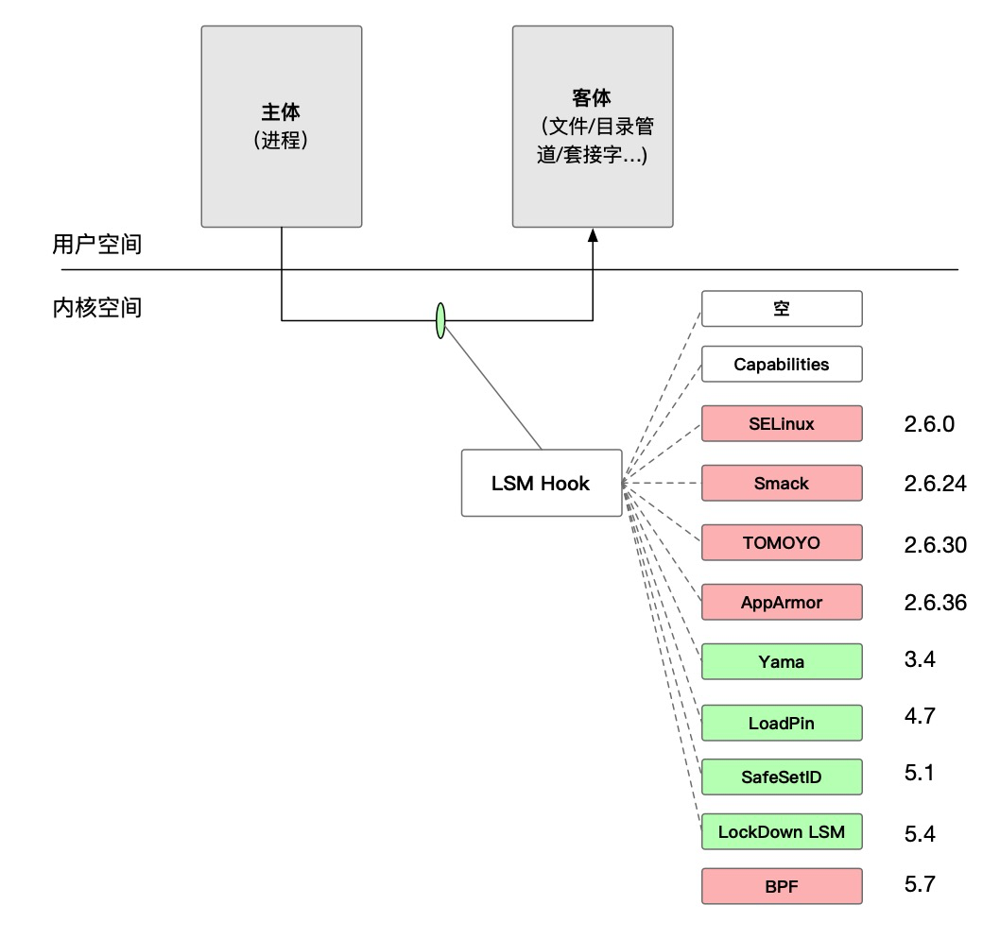
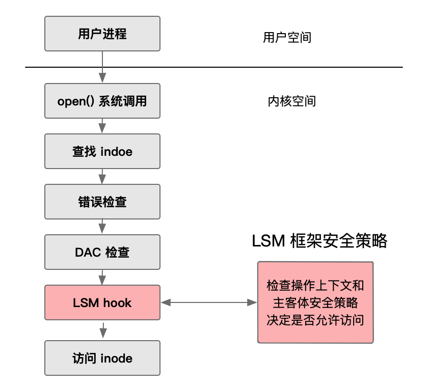

- [LSM源码分析](#lsm源码分析)
  - [全局映像](#全局映像)
    - [lsm子系统入口点](#lsm子系统入口点)
      - [每个hook都有两个声明](#每个hook都有两个声明)
      - [钩子函数并非都是return 0](#钩子函数并非都是return-0)
  - [核心数据结构](#核心数据结构)
    - [lsm\_info结构体](#lsm_info结构体)
    - [security\_hook\_heads结构体](#security_hook_heads结构体)
    - [security\_list\_options联合体](#security_list_options联合体)
    - [security\_hook\_list结构体](#security_hook_list结构体)
    - [lsm\_blob\_size结构体](#lsm_blob_size结构体)
  - [关键流程](#关键流程)
    - [LSM子系统初始化之编译期准备](#lsm子系统初始化之编译期准备)
    - [LSM子系统初始化之early\_security\_init和security\_hook\_heads的初始化](#lsm子系统初始化之early_security_init和security_hook_heads的初始化)
    - [LSM子系统初始化之security\_init初始化](#lsm子系统初始化之security_init初始化)
    - [LSM子模块的编译器准备](#lsm子模块的编译器准备)
    - [LSM子模块的初始化逻辑](#lsm子模块的初始化逻辑)
    - [LSM钩子函数的调用机制](#lsm钩子函数的调用机制)
  - [附录](#附录)
    - [附录一：hlist结构体](#附录一hlist结构体)
    - [附录二：hook点名称](#附录二hook点名称)
    - [附录三：security\_list\_options枚举类型展开](#附录三security_list_options枚举类型展开)
    - [附录四：security\_hook\_heads结构体展开](#附录四security_hook_heads结构体展开)
    - [附录五：selinux注册的钩子](#附录五selinux注册的钩子)
  - [参考](#参考)

# LSM源码分析

## 全局映像






### lsm子系统入口点

* 一般入口点有几种，从main入手，从init入手，lsm可以从该子系统对外暴露的接口入手
* 头文件 include/linux/security.h
* 头文件定义了入口函数

提取所有security_开头的函数

```shell
grep -oE 'security_[a-zA-Z0-9_]+' include/linux/security.h |sort -u
```

参考附录中hook点名称

* 这些hook点都是提前设定好，埋在kernel各个子系统，主动调用的，如果没有打开lsm 则会编译忽略对应逻辑。若打开则会进入lsm逻辑


```shell
#!/bin/bash
#


for f in `cat f`; do
	echo "# security hook: $f"
	echo ""
	rg --count  $f  arch/  block/  certs/  crypto/  Documentation/  drivers/  fs/  init/  io_uring/  ipc/  kernel/  lib/  LICENSES/  mm/  net/  rust/  samples/  scripts/    sound/  tools/  usr/  virt/
	echo ""
	echo "\`\`\`shell"
	rg -B3 -A3 $f  arch/  block/  certs/  crypto/  Documentation/  drivers/  fs/  init/  io_uring/  ipc/  kernel/  lib/  LICENSES/  mm/  net/  rust/  samples/  scripts/    sound/  tools/  usr/  virt/
	echo "\`\`\`"
	echo ""
	echo "---"
	echo ""
done

```


关于入口点，必须清楚几点
1. 所有函数都是静态预埋在内核关键路径的，没有神奇魔法，就是静态+主动调用。当然没有主动调用就没有防护。
2. 如果关键路径没有做检测，则直接绕过LSM及其所有LSM模块
3. 关键路径经过几年设定、修改、调整，基本能覆盖大部分，但是不能说100%，还是可以继续扩充LSM hook点，增加更多防护能力
4. 有多强的防护，覆盖面有多广，与hook点数量、所在路径有一定关系


#### 每个hook都有两个声明

从security.h中的 ```/* Security operations */``` 开始，后续就是每个hook点定义。

为何每个hook有两个声明。一个是纯粹声明，另一个是声明+定义空函数（或返回特定组合）。

```c
int security_binder_set_context_mgr(const struct cred *mgr);
```

```c

static inline int security_binder_set_context_mgr(const struct cred *mgr)
{
	return 0;
}

```

因为内核子系统中预埋的函数，如果找不到定义会报错。

```c
drivers/android/binder.c
5135:	ret = security_binder_set_context_mgr(proc->cred);

```

一般而言，但不绝对，有几个例外。如果都是2个，252*2 = 504，相差4个，这4个什么情况？

```shell
# grep -oE ' security_[a-zA-Z0-9_]+' include/linux/security.h |wc -l
508
# grep -oE ' security_[a-zA-Z0-9_]+' include/linux/security.h |sort -u |wc -l
252
```

```text
# grep -oE ' security_[a-zA-Z0-9_]+' include/linux/security.h | sort | uniq -c | sort -n
      2  security_audit_rule_free
      2  security_audit_rule_init
      2  security_audit_rule_known
      2  security_audit_rule_match
      2  security_binder_set_context_mgr
      2  security_binder_transaction
      2  security_binder_transfer_binder
      2  security_binder_transfer_file
      2  security_bpf
      2  security_bpf_map
      2  security_bpf_map_alloc
      2  security_bpf_map_free
      2  security_bpf_prog
      2  security_bpf_prog_alloc
      2  security_bpf_prog_free
      2  security_bprm_check
      2  security_bprm_committed_creds
      2  security_bprm_committing_creds
      2  security_bprm_creds_for_exec
      2  security_bprm_creds_from_file
      2  security_capable
      2  security_capget
      2  security_capset
      2  security_create_user_ns
      2  security_cred_alloc_blank
      2  security_cred_free
      2  security_cred_getsecid
      2  security_current_getsecid_subj
      2  security_dentry_create_files_as
      2  security_dentry_init_security
      2  security_d_instantiate
      2  security_file_alloc
      2  security_file_fcntl
      2  security_file_free
      2  security_file_ioctl
      2  security_file_ioctl_compat
      2  security_file_lock
      2  security_file_mprotect
      2  security_file_open
      2  security_file_permission
      2  security_file_receive
      2  security_file_send_sigiotask
      2  security_file_set_fowner
      2  security_file_truncate
      2  security_free_mnt_opts
      2  security_fs_context_dup
      2  security_fs_context_parse_param
      2  security_fs_context_submount
      2  security_getprocattr
      2  security_ib_alloc_security
      2  security_ib_endport_manage_subnet
      2  security_ib_free_security
      2  security_ib_pkey_access
      2  security_inet_conn_established
      2  security_inet_conn_request
      2  security_inet_csk_clone
      2  security_init
      2  security_inode_alloc
      2  security_inode_copy_up
      2  security_inode_copy_up_xattr
      2  security_inode_create
      2  security_inode_follow_link
      2  security_inode_free
      2  security_inode_get_acl
      2  security_inode_getattr
      2  security_inode_getsecctx
      2  security_inode_getsecid
      2  security_inode_getsecurity
      2  security_inode_getxattr
      2  security_inode_init_security_anon
      2  security_inode_invalidate_secctx
      2  security_inode_killpriv
      2  security_inode_link
      2  security_inode_listsecurity
      2  security_inode_listxattr
      2  security_inode_mkdir
      2  security_inode_mknod
      2  security_inode_need_killpriv
      2  security_inode_notifysecctx
      2  security_inode_permission
      2  security_inode_post_setxattr
      2  security_inode_readlink
      2  security_inode_remove_acl
      2  security_inode_removexattr
      2  security_inode_rename
      2  security_inode_rmdir
      2  security_inode_set_acl
      2  security_inode_setattr
      2  security_inode_setsecctx
      2  security_inode_setsecurity
      2  security_inode_setxattr
      2  security_inode_symlink
      2  security_inode_unlink
      2  security_ipc_getsecid
      2  security_ipc_permission
      2  security_ismaclabel
      2  security_kernel_act_as
      2  security_kernel_create_files_as
      2  security_kernel_load_data
      2  security_kernel_module_request
      2  security_kernel_post_load_data
      2  security_kernel_post_read_file
      2  security_kernel_read_file
      2  security_kernfs_init_security
      2  security_key_alloc
      2  security_key_free
      2  security_key_getsecurity
      2  security_key_permission
      2  security_mmap_addr
      2  security_mmap_file
      2  security_move_mount
      2  security_mptcp_add_subflow
      2  security_msg_msg_alloc
      2  security_msg_msg_free
      2  security_msg_queue_alloc
      2  security_msg_queue_associate
      2  security_msg_queue_free
      2  security_msg_queue_msgctl
      2  security_msg_queue_msgrcv
      2  security_msg_queue_msgsnd
      2  security_netlink_send
      2  security_path_chmod
      2  security_path_chown
      2  security_path_chroot
      2  security_path_link
      2  security_path_mkdir
      2  security_path_mknod
      2  security_path_notify
      2  security_path_rename
      2  security_path_rmdir
      2  security_path_symlink
      2  security_path_truncate
      2  security_path_unlink
      2  security_perf_event_alloc
      2  security_perf_event_free
      2  security_perf_event_open
      2  security_perf_event_read
      2  security_perf_event_write
      2  security_post_notification
      2  security_prepare_creds
      2  security_ptrace_access_check
      2  security_ptrace_traceme
      2  security_quotactl
      2  security_quota_on
      2  security_release_secctx
      2  security_req_classify_flow
      2  security_sb_alloc
      2  security_sb_clone_mnt_opts
      2  security_sb_delete
      2  security_sb_eat_lsm_opts
      2  security_sb_free
      2  security_sb_kern_mount
      2  security_sb_mnt_opts_compat
      2  security_sb_mount
      2  security_sb_pivotroot
      2  security_sb_remount
      2  security_sb_show_options
      2  security_sb_statfs
      2  security_sb_umount
      2  security_sctp_assoc_established
      2  security_sctp_assoc_request
      2  security_sctp_bind_connect
      2  security_sctp_sk_clone
      2  security_secctx_to_secid
      2  security_secid_to_secctx
      2  security_secmark_refcount_dec
      2  security_secmark_refcount_inc
      2  security_secmark_relabel_packet
      2  security_sem_alloc
      2  security_sem_associate
      2  security_sem_free
      2  security_sem_semctl
      2  security_sem_semop
      2  security_setprocattr
      2  security_settime64
      2  security_shm_alloc
      2  security_shm_associate
      2  security_shm_free
      2  security_shm_shmat
      2  security_shm_shmctl
      2  security_sk_alloc
      2  security_skb_classify_flow
      2  security_sk_classify_flow
      2  security_sk_clone
      2  security_sk_free
      2  security_socket_accept
      2  security_socket_bind
      2  security_socket_connect
      2  security_socket_create
      2  security_socket_getpeername
      2  security_socket_getpeersec_dgram
      2  security_socket_getpeersec_stream
      2  security_socket_getsockname
      2  security_socket_getsockopt
      2  security_socket_listen
      2  security_socket_post_create
      2  security_socket_recvmsg
      2  security_socket_sendmsg
      2  security_socket_setsockopt
      2  security_socket_shutdown
      2  security_socket_socketpair
      2  security_sock_graft
      2  security_sock_rcv_skb
      2  security_syslog
      2  security_task_alloc
      2  security_task_fix_setgid
      2  security_task_fix_setgroups
      2  security_task_fix_setuid
      2  security_task_free
      2  security_task_getioprio
      2  security_task_getpgid
      2  security_task_getscheduler
      2  security_task_getsecid_obj
      2  security_task_getsid
      2  security_task_kill
      2  security_task_movememory
      2  security_task_prctl
      2  security_task_setioprio
      2  security_task_setnice
      2  security_task_setpgid
      2  security_task_setrlimit
      2  security_task_setscheduler
      2  security_task_to_inode
      2  security_transfer_creds
      2  security_tun_dev_alloc_security
      2  security_tun_dev_attach
      2  security_tun_dev_attach_queue
      2  security_tun_dev_create
      2  security_tun_dev_free_security
      2  security_tun_dev_open
      2  security_unix_may_send
      2  security_unix_stream_connect
      2  security_uring_cmd
      2  security_uring_override_creds
      2  security_uring_sqpoll
      2  security_vm_enough_memory_mm
      2  security_watch_key
      2  security_xfrm_decode_session
      2  security_xfrm_policy_alloc
      2  security_xfrm_policy_clone
      2  security_xfrm_policy_delete
      2  security_xfrm_policy_free
      2  security_xfrm_policy_lookup
      2  security_xfrm_state_alloc
      2  security_xfrm_state_alloc_acquire
      2  security_xfrm_state_delete
      2  security_xfrm_state_free
      2  security_xfrm_state_pol_flow_match
      3  security_inode_init_security
      3  security_locked_down
      3  security_sb_set_mnt_opts
      3  security_task_prlimit

```


可知， security_inode_init_security、security_locked_down/security_sb_set_mnt_opts/security_task_prlimit 都锚定了3次，过滤发现，很明显，是因为注释里也有这些函数名称

```shell
# grep -E 'security_inode_init_security|security_locked_down|security_sb_set_mnt_opts|security_task_prlimit' include/linux/security.h 
/* LSM Agnostic defines for security_sb_set_mnt_opts() flags */
 * These are reasons that can be passed to the security_locked_down()
/* Flags for security_task_prlimit(). */
/* security_inode_init_security callback function to write xattrs */
int security_sb_set_mnt_opts(struct super_block *sb,
int security_inode_init_security(struct inode *inode, struct inode *dir,
int security_inode_init_security_anon(struct inode *inode,
int security_task_prlimit(const struct cred *cred, const struct cred *tcred,
int security_locked_down(enum lockdown_reason what);
static inline int security_sb_set_mnt_opts(struct super_block *sb,
static inline int security_inode_init_security(struct inode *inode,
static inline int security_inode_init_security_anon(struct inode *inode,
static inline int security_task_prlimit(const struct cred *cred,
static inline int security_locked_down(enum lockdown_reason what)


```


#### 钩子函数并非都是return 0

```shell

static inline int security_inode_need_killpriv(struct dentry *dentry)
{
	return cap_inode_need_killpriv(dentry);
}

static inline int security_inode_killpriv(struct mnt_idmap *idmap,
					  struct dentry *dentry)
{
	return cap_inode_killpriv(idmap, dentry);
}

static inline int security_inode_getsecurity(struct mnt_idmap *idmap,
					     struct inode *inode,
					     const char *name, void **buffer,
					     bool alloc)
{
	return cap_inode_getsecurity(idmap, inode, name, buffer, alloc);
}
```

1. 与hook位置有关，必须要做默认处理逻辑
2. cap_inode_killpriv 是 Linux 内核 Capabilities LSM辅助函数之一。职责是在文件内容被修改之前，强制清除该文件上所有可能提升权限的“安全标记”。 如果不执行这个操作，普通用户修改了属于 root 的可执行文件后，该文件可能依然保留 root 权限，从而导致严重的提权漏洞。

在这里可以主动调用cap_inode_killpriv，等到 security_inode_killpriv 返回0也是可以的。但是似乎会混乱，责任边界不清晰，要是子系统没有调用，会有风险，因此这样设计。

```c
kill_priv:
        /* User has permission for the change */
        if (ia_valid & ATTR_KILL_PRIV) {
                int error;

                error = security_inode_killpriv(idmap, dentry);
                if (error)
                        return error;
        }

        return 0;
}
EXPORT_SYMBOL(setattr_prepare);
```

## 核心数据结构

Linux 内核的 LSM（Linux Security Module）子系统 是一个模块化、可堆叠的安全框架，用于在内核中插入访问控制策略（如 SELinux、AppArmor、Lockdown 等）。
为了支持这一机制，LSM 框架定义了一系列核心数据结构，它们共同构成了 LSM 的注册、调用、上下文管理和初始化基础设施。

### lsm_info结构体

```c
struct lsm_info {
	const char *name;	/* Required. */
	enum lsm_order order;	/* Optional: default is LSM_ORDER_MUTABLE */
	unsigned long flags;	/* Optional: flags describing LSM */
	int *enabled;		/* Optional: controlled by CONFIG_LSM */
	int (*init)(void);	/* Required. */
	struct lsm_blob_sizes *blobs; /* Optional: for blob sharing. */
};

enum lsm_order {
	LSM_ORDER_FIRST = -1,	/* This is only for capabilities. */
	LSM_ORDER_MUTABLE = 0,
	LSM_ORDER_LAST = 1,	/* This is only for integrity. */
};

#define DEFINE_LSM(lsm)                         \
    static struct lsm_info __lsm_##lsm              \
        __used __section(".lsm_info.init")          \
        __aligned(sizeof(unsigned long))
```

* 描述一个 LSM 模块的元信息和初始化入口
* 每个 LSM 在编译时通过 DEFINE_LSM() 宏定义一个 lsm_info 实例。 
* 链接器将所有 lsm_info 放入 .lsm_info 或 .early_lsm_info 段，形成数组：
  - __start_lsm_info / __end_lsm_info
  - __start_early_lsm_info / __end_early_lsm_info
* 各个LSM模块声明、定义好lsm_info，放置与固定节就行了。然后基于initcall机制去遍历info实现初始化
* 关键元素是name和init，没有名称怎么知道它是什么lsm模块？没有初始化则呢么使能？

```c
# rg DEFINE_LSM -A 6
security/apparmor/lsm.c
1973:DEFINE_LSM(apparmor) = {
1974-	.name = "apparmor",
1975-	.flags = LSM_FLAG_LEGACY_MAJOR | LSM_FLAG_EXCLUSIVE,
1976-	.enabled = &apparmor_enabled,
1977-	.blobs = &apparmor_blob_sizes,
1978-	.init = apparmor_init,
1979-};

security/lockdown/lockdown.c
163:DEFINE_LSM(lockdown) = {
165-	.name = "lockdown",
166-	.init = lockdown_lsm_init,
167-};

security/commoncap.c
1471:DEFINE_LSM(capability) = {
1472-	.name = "capability",
1473-	.order = LSM_ORDER_FIRST,
1474-	.init = capability_init,
1475-};

security/safesetid/lsm.c
282:DEFINE_LSM(safesetid_security_init) = {
283-	.init = safesetid_security_init,
284-	.name = "safesetid",
285-};

security/yama/yama_lsm.c
479:DEFINE_LSM(yama) = {
480-	.name = "yama",
481-	.init = yama_init,
482-};

security/tomoyo/tomoyo.c
610:DEFINE_LSM(tomoyo) = {
611-	.name = "tomoyo",
612-	.enabled = &tomoyo_enabled,
613-	.flags = LSM_FLAG_LEGACY_MAJOR,
614-	.blobs = &tomoyo_blob_sizes,
615-	.init = tomoyo_init,
616-};

security/bpf/hooks.c
29:DEFINE_LSM(bpf) = {
30-	.name = "bpf",
31-	.init = bpf_lsm_init,
32-	.blobs = &bpf_lsm_blob_sizes
33-};

security/selinux/hooks.c
7348:DEFINE_LSM(selinux) = {
7349-	.name = "selinux",
7350-	.flags = LSM_FLAG_LEGACY_MAJOR | LSM_FLAG_EXCLUSIVE,
7351-	.enabled = &selinux_enabled_boot,
7352-	.blobs = &selinux_blob_sizes,
7353-	.init = selinux_init,
7354-};

security/loadpin/loadpin.c
267:DEFINE_LSM(loadpin) = {
268-	.name = "loadpin",
269-	.init = loadpin_init,
270-};

security/smack/smack_lsm.c
5194:DEFINE_LSM(smack) = {
5195-	.name = "smack",
5196-	.flags = LSM_FLAG_LEGACY_MAJOR | LSM_FLAG_EXCLUSIVE,
5197-	.blobs = &smack_blob_sizes,
5198-	.init = smack_init,
5199-};

security/landlock/setup.c
67:DEFINE_LSM(LANDLOCK_NAME) = {
68-	.name = LANDLOCK_NAME,
69-	.init = landlock_init,
70-	.blobs = &landlock_blob_sizes,
71-};

security/integrity/iint.c
203:DEFINE_LSM(integrity) = {
204-	.name = "integrity",
205-	.init = integrity_iintcache_init,
206-	.order = LSM_ORDER_LAST,
207-};
```

### security_hook_heads结构体

* 全局唯一，early 阶段初始化
* security_hook_heads是 LSM 针对每个钩子定义链表存放函数指针
* 为每一个 LSM 安全钩子（hook）维护一个函数指针链表（hlist），允许多个 LSM 模块将各自的回调函数注册到同一个钩子上，从而支持 LSM 的“堆叠”（stacking）机制
* 早期 Linux 只允许一个“主 LSM”（如 SELinux 或 AppArmor），从 Linux 5.x 起，内核支持 LSM stacking：多个 LSM 可同时启用（如 lockdown + yama + selinux）。当内核执行到某个安全检查点（如打开文件）时，需要依次调用所有已注册 LSM 的对应 hook 函数。security_hook_heads.file_open 就是用来集中管理所有 LSM 对 file_open 的实现的链表。
  
在 include/linux/lsm_hooks.h 定义了结构体 security_hook_heads

``c

struct security_hook_heads {
    #define LSM_HOOK(RET, DEFAULT, NAME, ...) struct hlist_head NAME;
    #include "lsm_hook_defs.h"
    #undef LSM_HOOK
} __randomize_layout;

``

将它展开，就会看到，一个hlist_head组成的结构体，每一项8字节，数量就是当前系统支持的钩子。具体数量取决于配置，部分钩子根据配置打开

```c
crash> struct security_hook_heads 
struct security_hook_heads {
    struct hlist_head binder_set_context_mgr;
    struct hlist_head binder_transaction;
    struct hlist_head binder_transfer_binder;
    struct hlist_head binder_transfer_file;
    struct hlist_head ptrace_access_check;
    struct hlist_head ptrace_traceme;
...
}
```

这里只是定义了每个钩子的链表头，那么，自然能联想到，

* 如何注册钩子？添加函数到对应的钩子hlist_head中就行
* 关键路径中、预埋的security_函数如何调用钩子？遍历hlist_head中的函数逐个执行（有一个拒绝权限则直接返回拒绝，否则全部都会执行）
* 注册时：每个 LSM 在初始化时，将自己的 file_open 函数地址封装成 struct security_hook_list，插入到 security_hook_heads.file_open 链表中
* 调用时：内核通过宏（如 security_file_open(file)）遍历该链表，依次调用每个函数

### security_list_options联合体

* 类型安全的函数指针容器
* 如果没有这个 union，LSM 框架只能用 void * 或通用函数指针存储 hook。这样就没法做类型安全检查
* 没有安全检查可能导致，编译器无法检查函数签名是否匹配，容易因参数错误导致内核崩溃。
* union security_list_options 是一个 类型（type），不是变量
* union 本身是编译期类型，无“初始化”概念

security_list_options 通过 union + 宏生成 实现：
* 编译期类型检查：当你写 hook.file_open = my_func，编译器会验证 my_func 是否为 int (*)(struct file *)。
* 运行时正确调用：调用时直接使用 p->hook.file_open(file)，无需强制转换。
* 既安全，又高效，还简洁。

每个 security_hook_list 实例包含一个 security_list_options

当 LSM 注册 hook 时：
```c
hook->hook.file_open = selinux_file_open; // 类型安全赋值
```

当内核调用 hook 时：
```c
ret = p->hook.file_open(file); // 类型安全调用
```


```c
union security_list_options {
	#define LSM_HOOK(RET, DEFAULT, NAME, ...) RET (*NAME)(__VA_ARGS__);
	#include "lsm_hook_defs.h"
	#undef LSM_HOOK
};

```

展开后, 存放函数声明

```c
crash> union security_list_options
union security_list_options {
    int (*binder_set_context_mgr)(const struct cred *);
    int (*binder_transaction)(const struct cred *, const struct cred *);
 ...
    int (*uring_sqpoll)(void);
    int (*uring_cmd)(struct io_uring_cmd *);
}
SIZE: 8
```


| 特性 | 说明 |
|------|------|
| 类型安全 | 编译期确保 hook 函数签名正确，防止内核崩溃 |
| 内存高效 | 仅 8 字节，支持所有 200+ hook 类型 |
| 自动生成 | 通过 `lsm_hook_defs.h` 宏统一维护，避免手动同步错误 |
| 堆叠基础 | 使多个 LSM 能安全共存于同一 hook 点 |
| 非全局变量 | 是类型定义，每个 `security_hook_list` 拥有一个实例 |


### security_hook_list结构体

* 每个 LSM 独立定义自己的 security_hook_list 数组
* 每当一个 LSM（如 SELinux）想注册自己的 file_open 函数，就会创建一个 security_hook_list 实例
* 用于注册和管理单个安全钩子（hook）的核心数据结构。它的存在使得多个 LSM 模块能够 安全、类型正确、可堆叠（stackable）地 向同一个安全检查点（如文件打开、进程创建等）注册各自的策略函数。

这么想，每个LSM模块都会注册多个钩子实现对应模块的安全能力，是不是直接链接到上面的security_list_head就行了？

* 不，需要单独创建一个数据结构，和一个security_add_hooks来实现统一注册
* ```union security_list_options	hook```的使用很巧妙，这是一个 union，包含所有可能的 LSM hook 函数签名，统一了钩子类型

为什么用 union？

* 避免使用 void (*)() 导致的类型不安全。
* 编译器能检查函数签名是否匹配。
* 节省内存（union 只占最大成员的空间）。

```c
/*
 * Security module hook list structure.
 * For use with generic list macros for common operations.
 */
struct security_hook_list {
	struct hlist_node		list;
	struct hlist_head		*head;
	union security_list_options	hook;
	const char			*lsm;
} __randomize_layout;


```

当模块初始化时候，就会调用注册逻辑

步骤一：LSM 调用 security_add_hooks()

````c
static struct security_hook_list selinux_hooks[] __lsm_ro_after_init = {
    LSM_HOOK_INIT(file_open, selinux_file_open),
    LSM_HOOK_INIT(inode_create, selinux_inode_create),
    // ...
};

static int __init selinux_init(void)
{
    security_add_hooks(selinux_hooks, ARRAY_SIZE(selinux_hooks), "selinux");
    return 0;
}
````

其中 LSM_HOOK_INIT(NAME, FUNC) 展开为：
```c
{ .head = &security_hook_heads.NAME, .hook.NAME = FUNC, .lsm = "selinux" }
```

步骤二：security_add_hooks() 执行注册

该函数内部对每个 security_hook_list 做：

```c
void __init security_add_hooks(struct security_hook_list *hooks, int count, const char *lsm)
{
    for (i = 0; i < count; i++) {
        hooks[i].lsm = lsm;
        // 将 hooks[i].list 插入到 hooks[i].head 所指向的 hlist_head 中
        hlist_add_head(&hooks[i].list, hooks[i].head);
    }
}
```

关键动作：```hlist_add_head(&hook->list, hook->head);```把 security_hook_list.list 挂到 security_hook_heads.XXX 链表上

示意图：

```c
全局变量:
+--------------------------------------------------+
| security_hook_heads                              |
|                                                  |
|  .file_open:  [hlist_head] ────────────────┐     |
|  .inode_create: [hlist_head] ────────┐     |     |
|  ...                                 |     |     |
+--------------------------------------|-----|-----+
                                       |     |
                                       |     |
SELinux 注册的节点:                      |     |
+----------------------+               |     |
| security_hook_list   | <─────────────┘     |
|  .list  → (hlist_node)                     |
|  .head  → &security_hook_heads.file_open   |
|  .hook.file_open = selinux_file_open       |
|  .lsm = "selinux"                          |
+----------------------+                     |
                                             |
AppArmor 注册的节点:                           |
+----------------------+                     |
| security_hook_list   | <───────────────────┘
|  .list  → (hlist_node)                     
|  .head  → &security_hook_heads.file_open   
|  .hook.file_open = apparmor_file_open      
|  .lsm = "apparmor"                         
+----------------------+
```

```c
+----------------------------------+      +--------------------------+
| security_hook_heads              |      | struct security_hook_list|
|                                  |      | (例如 SELinux 的实例)      |
|  .file_open [hlist_head]         |<---->|                          |
|     |                            |      |  .head -> &security_...  |
|     +--> [hlist_node]            |      |  .hook.file_open = ...   |
|     |                            |      |  .lsm = "selinux"        |
|     +--> [hlist_node]            |      +--------------------------+
|     |                            |      
|  .inode_create [hlist_head]      |      +---------------------------+
|     |                            |      | struct security_hook_list |
|     +--> [hlist_node]            |      | (例如 AppArmor 的实例)      |
|     |                            |      |                           |
|     ...                          |      |  .head -> &security_...   |
|                                  |      |  .hook.inode_create = ..  |
+----------------------------------+      |  .lsm = "apparmor"        |
                                           +--------------------------+
```

### lsm_blob_size结构体

由来：
早期的 LSM（如 SELinux、Smack）直接使用 void *security 指针字段附加到内核对象（例如 task_struct、inode 等）上。这种方式在单个 LSM 时工作良好，但当多个 LSM 同时启用（stacking）时，每个 LSM 都需要自己的私有数据，而只有一个 void * 字段显然不够用。
为了解决这个问题，从内核 v5.0 开始引入了 LSM blob infrastructure（LSM 数据块基础设施）。其核心思想是：
1. 在编译时确定所有启用的 LSM 所需的总 blob 大小；
2. 在内核对象中预留一块足够大的连续内存区域（称为 "security blob"）；
3. 每个 LSM 在初始化时被分配一个偏移量（offset），用于访问自己专属的数据区域。

这样就支持了多个 LSM 同时运行（stacked LSMs），且避免了指针间接访问带来的性能开销和内存碎片。

security 字段仍然存在（例如在 task_struct 中），但它现在指向的是这块 统一分配的 blob 内存块，而非某个 LSM 的私有结构。

这种方式避免了 ABI 变更（不修改核心结构体），也避免了多次间接指针跳转（性能更好）

它在内核启动早期，精确计算出所有启用的LSM安全模块对各类内核对象所需的安全上下文总内存，并据此分配资源、创建缓存、设置偏移，使得多个 LSM 能在不冲突、不浪费的前提下，安全地扩展内核对象的安全属性。

目标：允许多个 LSM 同时在内核对象中存储私有安全数据，记录所有启用 LSM 所需的安全上下文总大小

由于 LSM 不能直接修改 task_struct、cred 等内核核心结构体（会破坏 ABI 兼容性），LSM 框架采用 “预留一块通用内存区域（blob）” 的策略：

1. 每个内核对象（如 task_struct）包含一个 void *security 字段。
2. 这块内存由 LSM 框架统一分配，大小 = 所有启用 LSM 对该对象所需空间之和。
3. 每个 LSM 在其中拥有自己的“子区域”，通过偏移访问。

* lsm_info中的 struct lsm_blob_sizes *blobs 就是给每个LSM记录自身所需不同类别security blob 中的偏移。还有就是统计全量
* blob_sizes 全局变量，是用来统计总量的

```c
/*
 * Security blob size or offset data.
 */
struct lsm_blob_sizes {
	int	lbs_cred;
	int	lbs_file;
	int	lbs_inode;
	int	lbs_superblock;
	int	lbs_ipc;
	int	lbs_msg_msg;
	int	lbs_task;
	int	lbs_xattr_count; /* number of xattr slots in new_xattrs array */
};

static struct lsm_blob_sizes blob_sizes __ro_after_init;
```

* 全局变量，在 prepare_lsm() 阶段由各 LSM 调用 lsm_set_blob_size() 累加计算。
* 决定是否需要为 task_struct, cred, file 等对象分配 security blob。
* 用于创建 kmem_cache（如 lsm_file_cache）或直接分配内存。

如何计算？——lsm_set_blob_size() 机制

每个 LSM 在其 .init 阶段（实际是在 prepare_lsm() 中）调用：
```c
static void __init lsm_set_blob_size(int *need, int *lbs)
{
	int offset;

	if (*need <= 0)
		return;

	offset = ALIGN(*lbs, sizeof(void *));
	*lbs = offset + *need;
	*need = offset;
}

```
而 LSM 通常这样声明自己的需求：
```c
static void __init lsm_set_blob_sizes(struct lsm_blob_sizes *needed)
{
	if (!needed)
		return;

	lsm_set_blob_size(&needed->lbs_cred, &blob_sizes.lbs_cred);
	lsm_set_blob_size(&needed->lbs_file, &blob_sizes.lbs_file);
	/*
	 * The inode blob gets an rcu_head in addition to
	 * what the modules might need.
	 */
	if (needed->lbs_inode && blob_sizes.lbs_inode == 0)
		blob_sizes.lbs_inode = sizeof(struct rcu_head);
	lsm_set_blob_size(&needed->lbs_inode, &blob_sizes.lbs_inode);
	lsm_set_blob_size(&needed->lbs_ipc, &blob_sizes.lbs_ipc);
	lsm_set_blob_size(&needed->lbs_msg_msg, &blob_sizes.lbs_msg_msg);
	lsm_set_blob_size(&needed->lbs_superblock, &blob_sizes.lbs_superblock);
	lsm_set_blob_size(&needed->lbs_task, &blob_sizes.lbs_task);
	lsm_set_blob_size(&needed->lbs_xattr_count,
			  &blob_sizes.lbs_xattr_count);
}
```

其中 selinux_cred_blob_size = sizeof(struct selinux_cred);


计算流程（在 prepare_lsm() 中）

1. 初始化全局 blob_sizes 为全 0。
2. 遍历所有启用的 LSM（包括 early 和 regular）。
3. 对每个 LSM，调用其 set_blob_sizes 回调（或通过 lsm_info.id->slot 间接计算）。
4. 累加各 LSM 对每类对象的需求 → 得到最终 blob_sizes。

结果：blob_sizes.lbs_task = SELinux.task_size + AppArmor.task_size + ...

* Linux 6.6 使用 struct lsm_info 本身作为 LSM 的唯一标识，blobs 字段直接嵌入在 struct lsm_info 中
* lsm_blob_sizes 是每个LSM模块配置的，


设计哲学

| 原则 | 如何体现 |
|------|--------|
| 零侵入 | 不修改 `task_struct` 等结构体，通过外部 blob 扩展 |
| 模块化 | 每个 LSM 独立声明需求，框架自动聚合 |
| 内存高效 | 仅当有 LSM 启用时才分配 blob；使用 slab cache 优化 |
| 可组合 | SELinux + AppArmor + Yama 可共存，各自使用独立内存区域 |


lsm_info中的struct lsm_blob_sizes *blobs如何工作？

```c
// security/apparmor/lsm.c
/*
 * The cred blob is a pointer to, not an instance of, an aa_label.
 */
struct lsm_blob_sizes apparmor_blob_sizes __ro_after_init = { 
    .lbs_cred = sizeof(struct aa_label *),
    .lbs_file = sizeof(struct aa_file_ctx),
    .lbs_task = sizeof(struct aa_task_ctx),
};

DEFINE_LSM(apparmor) = {
    .name = "apparmor",
    .flags = LSM_FLAG_LEGACY_MAJOR | LSM_FLAG_EXCLUSIVE,
    .enabled = &apparmor_enabled,
    .blobs = &apparmor_blob_sizes,
    .init = apparmor_init,
};
```

* 每个LSM模块定义好自身实现所需的块大小，初始化的时候代表自己所需的大小
* 初始化之后，blobs就变成了偏移


在 ordered_lsm_init() → prepare_lsm() 阶段分配 blob：

```c
static void __init ordered_lsm_init(void)
{
	struct lsm_info **lsm;

	ordered_lsms = kcalloc(LSM_COUNT + 1, sizeof(*ordered_lsms),
			       GFP_KERNEL);

	if (chosen_lsm_order) {
		if (chosen_major_lsm) {
			pr_warn("security=%s is ignored because it is superseded by lsm=%s\n",
				chosen_major_lsm, chosen_lsm_order);
			chosen_major_lsm = NULL;
		}
		ordered_lsm_parse(chosen_lsm_order, "cmdline");
	} else
		ordered_lsm_parse(builtin_lsm_order, "builtin");

	for (lsm = ordered_lsms; *lsm; lsm++)
		prepare_lsm(*lsm);
	...
}
```

排序之后，接下来就是遍历lsm_info，按照顺序依次给每个分配偏移同时也计算总和

```c
/* Prepare LSM for initialization. */
static void __init prepare_lsm(struct lsm_info *lsm)
{
	int enabled = lsm_allowed(lsm);

	/* Record enablement (to handle any following exclusive LSMs). */
	set_enabled(lsm, enabled);

	/* If enabled, do pre-initialization work. */
	if (enabled) {
		if ((lsm->flags & LSM_FLAG_EXCLUSIVE) && !exclusive) {
			exclusive = lsm;
			init_debug("exclusive chosen:   %s\n", lsm->name);
		}

		lsm_set_blob_sizes(lsm->blobs);
	}
}

static void __init lsm_set_blob_sizes(struct lsm_blob_sizes *needed)
{
	if (!needed)
		return;

	lsm_set_blob_size(&needed->lbs_cred, &blob_sizes.lbs_cred);
	lsm_set_blob_size(&needed->lbs_file, &blob_sizes.lbs_file);
	/*
	 * The inode blob gets an rcu_head in addition to
	 * what the modules might need.
	 */
	if (needed->lbs_inode && blob_sizes.lbs_inode == 0)
		blob_sizes.lbs_inode = sizeof(struct rcu_head);
	lsm_set_blob_size(&needed->lbs_inode, &blob_sizes.lbs_inode);
	lsm_set_blob_size(&needed->lbs_ipc, &blob_sizes.lbs_ipc);
	lsm_set_blob_size(&needed->lbs_msg_msg, &blob_sizes.lbs_msg_msg);
	lsm_set_blob_size(&needed->lbs_superblock, &blob_sizes.lbs_superblock);
	lsm_set_blob_size(&needed->lbs_task, &blob_sizes.lbs_task);
	lsm_set_blob_size(&needed->lbs_xattr_count,
			  &blob_sizes.lbs_xattr_count);
}

static void __init lsm_set_blob_size(int *need, int *lbs)
{
	int offset;

	if (*need <= 0)
		return;

	offset = ALIGN(*lbs, sizeof(void *));
	*lbs = offset + *need;
	*need = offset; // 这里，把需要的大小，变成偏移
}
```

* ```*need = offset;```关键代码，原先need是提供对应lsm_info所需的slab大小，这里算进总量后直接变成了偏移。很巧妙的应用。

1. 初始时，*lbs = 0（全局 blob_sizes 成员）。
2. 第一个 LSM：need = N1 → offset = 0 → lbs = N1，need 被设为 0（偏移）。
3. 第二个 LSM：need = N2 → offset = ALIGN(N1, 8) → lbs = offset + N2，need 被设为 offset。
4. 最终，每个 LSM 的 .blobs->lbs_task 等字段不再是“大小”，而是它在 task blob 中的起始偏移。
5. 运行时访问：my_data = (my_struct *)(task->security + my_lsm_offset);

这是一种典型的 “in-place transformation”：同一个变量在初始化阶段先表示“需求”，后表示“位置”。


关于 lsm_info.blobs 的生命周期：

1. 每个 LSM 在定义 DEFINE_LSM() 时提供 .blobs = &my_blob_sizes。
2. 初始化前：.blobs 指向的结构体中各字段是 该 LSM 所需的大小。
3. prepare_lsm() 调用 lsm_set_blob_sizes() 后：这些字段被 覆盖为偏移量。
4. 因此，运行时可通过 lsm_info->blobs->lbs_task 直接获取偏移，无需额外存储。

这也是为什么 apparmor_blob_sizes 被标记为 __ro_after_init：初始化完成后内容不再改变，可放入只读内存。
这种设计节省了内存（无需单独存储偏移表），也提高了访问效率。


关于 slab cache 的创建：
1. 并非所有对象都使用 slab cache。
2. cred、task 等对象的 security blob 是直接嵌入到其主结构体的 security 指针所指向的内存中，该内存由 security_cred_alloc_blank() 等函数按 blob_sizes.lbs_cred 分配。
而 file、inode 等对象，由于其生命周期和分配方式不同，内核会为它们创建专用的 kmem_cache（如 lsm_file_cache），大小就是 blob_sizes.lbs_file。
3. 是否创建 cache 或直接分配，取决于对象类型和 LSM 框架的实现策略。


## 关键流程

### LSM子系统初始化之编译期准备

* 每个LSM在编译器都要准备好，编译器主要是 1. DEFINE_LSM 2. __lsm_ro_after_init 3. security_hook_heads定义
* 其中DEFINE_LSM是给每个LSM声明、定义一个lsm_info结构体
* 这里也很明显，没有考虑到LSM模块做成ko。但是eBPF LSM也是种动态扩展的能力

```c
/* SELinux requires early initialization in order to label
   all processes and objects when they are created. */
DEFINE_LSM(selinux) = {
    .name = "selinux",
    .flags = LSM_FLAG_LEGACY_MAJOR | LSM_FLAG_EXCLUSIVE,
    .enabled = &selinux_enabled_boot,
    .blobs = &selinux_blob_sizes,
    .init = selinux_init,
};
```

所有 struct lsm_info 实例被链接到 __start_lsm_info ~ __stop_lsm_info 区间。当然也可以放在early区间，但是没看到哪个模块放early。

security blob的申请，标记为初始化后设置为ro

这些数据在初始化完成后标记为只读（__ro_after_init），提升安全性

```c
struct lsm_blob_sizes selinux_blob_sizes __ro_after_init = {
    .lbs_cred = sizeof(struct task_security_struct),
    .lbs_file = sizeof(struct file_security_struct),
    .lbs_inode = sizeof(struct inode_security_struct),
    .lbs_ipc = sizeof(struct ipc_security_struct),
    .lbs_msg_msg = sizeof(struct msg_security_struct),
    .lbs_superblock = sizeof(struct superblock_security_struct),
    .lbs_xattr_count = SELINUX_INODE_INIT_XATTRS,
};  
```

* 所有 LSM 的元数据在编译时静态注册，无需动态注册接口。


```c
struct security_hook_heads security_hook_heads __ro_after_init; // C 语言允许结构体（struct）的标签名（tag name）和变量名相同
```

* 还有这里，定义了一个初始化之后变为只读的全局变量 security_hook_heads 
* 结构体的 tag（如 security_hook_heads in struct security_hook_heads）和普通变量名（如 security_hook_heads）属于不同的命名空间，因此可以同名而不会冲突
* 这个变量在我的环境看占用(SIZE: 1984)，还没完成初始化，每个节点指针都是null


这些编译后就确定了，vmlinuz支持哪些LSM模块（不一定启用），钩子点有哪些（不支持动态增减）


### LSM子系统初始化之early_security_init和security_hook_heads的初始化

*  Linux 内核 LSM（Linux Security Module）框架中的一个早期初始化函数，它的主要作用是在内核启动的非常早期阶段，初始化那些被标记为early（早期）的 LSM 模块
* 普通 LSM（在 security_init() 中初始化）启动较晚，此时内核已经完成了大量初始化工作（如 VFS、内存管理、设备驱动等）。但有些安全机制必须在这些子系统初始化之前就生效，否则会有安全窗口（security window）被利用。
* early LSM 机制允许关键安全模块在 start_kernel() 的极早期（在 MM、VFS、IRQ 等子系统初始化之前）就激活。
* 这里的early是指，内核还没用完全启动（内存等子系统没有完成初始化）
* 内核引入 早期 LSM（Early LSM）机制，通过 early_security_init() 在 start_kernel() 极早期（早于 MMU 完全启用、VFS、IRQ、进程调度等）完成关键安全策略的部署

```c
asmlinkage __visible void __init start_kernel(void)
{
    ...
    setup_arch(&command_line);
    ...
    mm_init();                 // 内存管理初步初始化
    ...
    early_security_init();     // ←←← 极早期安全初始化（关键！）
    ...
    rcu_init();
    time_init();
    sched_init();
    ...
    security_init();           // ←←← 常规 LSM 初始化（较晚）
    ...
}
```

* early_security_init() 执行时，内核尚未建立完整的进程、文件系统、设备模型，但已具备基本内存和控制流能力，足以初始化轻量级安全钩子

```c
int __init early_security_init(void)
{
    struct lsm_info *lsm;

#define LSM_HOOK(RET, DEFAULT, NAME, ...) \
    INIT_HLIST_HEAD(&security_hook_heads.NAME);
#include "linux/lsm_hook_defs.h"
#undef LSM_HOOK

    for (lsm = __start_early_lsm_info; lsm < __end_early_lsm_info; lsm++) {
        if (!lsm->enabled)
            lsm->enabled = &lsm_enabled_true;
        prepare_lsm(lsm);
        initialize_lsm(lsm);
    }

    return 0;
}

/* Prepare LSM for initialization. */
static void __init prepare_lsm(struct lsm_info *lsm)
{
	int enabled = lsm_allowed(lsm);

	/* Record enablement (to handle any following exclusive LSMs). */
	set_enabled(lsm, enabled);

	/* If enabled, do pre-initialization work. */
	if (enabled) {
		if ((lsm->flags & LSM_FLAG_EXCLUSIVE) && !exclusive) {
			exclusive = lsm;
			init_debug("exclusive chosen:   %s\n", lsm->name);
		}

		lsm_set_blob_sizes(lsm->blobs);
	}
}

/* Initialize a given LSM, if it is enabled. */
static void __init initialize_lsm(struct lsm_info *lsm)
{
	if (is_enabled(lsm)) {
		int ret;

		init_debug("initializing %s\n", lsm->name);
		ret = lsm->init();
		WARN(ret, "%s failed to initialize: %d\n", lsm->name, ret);
	}
}
```

* security_hook_heads 在这里逐个调用INIT_HLIST_HEAD进行初始化。初始化所有安全钩子（security hooks）链表头
* 为每一个 LSM 安全钩子（如 inode_create, task_alloc, file_open 等）初始化一个空的哈希链表头（hlist_head），以便后续多个 LSM 模块可以将自己的 hook 函数挂载到该链表上。
* 这是实现 “堆叠式 LSM（stacked LSM）” 的基础：多个 LSM 可以同时注册同一个 hook，内核按顺序调用它们。

这里很关键，早起初始化，就必须对钩子的hlist进行初始化

```c
#define LSM_HOOK(RET, DEFAULT, NAME, ...) \
    INIT_HLIST_HEAD(&security_hook_heads.NAME);
#include "linux/lsm_hook_defs.h"
#undef LSM_HOOK
```

* 展开后其实就是初始化链表头
*  早期 LSM（如 Lockdown）在 .init() 函数中会立即调用 security_add_hooks()，将自身 hook 挂入 security_hook_heads.XXX 链表。如果链表头未初始化（即 first 为随机值），会导致 内核崩溃或 hook 注册失败

```c
#define INIT_HLIST_HEAD(ptr) ((ptr)->first = NULL)
    INIT_HLIST_HEAD(&security_hook_heads.ptrace);
    INIT_HLIST_HEAD(&security_hook_heads.file_open);
    INIT_HLIST_HEAD(&security_hook_heads.socket_create);
    ...
```

另外，这里放到early初始化的LSM，6.6内核只有一个

```c
# rg DEFINE_EARLY_LSM
include/linux/lsm_hooks.h
135:#define DEFINE_EARLY_LSM(lsm)						\

security/lockdown/lockdown.c
160 #ifdef CONFIG_SECURITY_LOCKDOWN_LSM_EARLY
161 DEFINE_EARLY_LSM(lockdown) = {
162 #else
163 DEFINE_LSM(lockdown) = {
164 #endif
165     .name = "lockdown",
166     .init = lockdown_lsm_init,
167 };
```

这里依然是，很巧妙的将lsm_info放到特定节，然后用initcall初始化它

```c
extern struct lsm_info __start_lsm_info[], __end_lsm_info[];
extern struct lsm_info __start_early_lsm_info[], __end_early_lsm_info[];

#define DEFINE_LSM(lsm)							\
	static struct lsm_info __lsm_##lsm				\
		__used __section(".lsm_info.init")			\
		__aligned(sizeof(unsigned long))

#define DEFINE_EARLY_LSM(lsm)						\
	static struct lsm_info __early_lsm_##lsm			\
		__used __section(".early_lsm_info.init")		\
		__aligned(sizeof(unsigned long))
```


| 特性                  | `early_security_init()`             | `security_init()`                |
|----------------------|------------------------------------|----------------------------------|
| 调用时机              | `start_kernel()` 极早期            | `start_kernel()` 中后期          |
| 初始化对象            | `security_hook_heads` + Early LSM  | Capability + 普通 LSM（SELinux 等） |
| 依赖子系统            | 几乎无（仅需基本内存）             | VFS、cred、SLAB 等已初始化       |
| 典型 LSM              | Lockdown                           | SELinux, AppArmor, Smack, Yama...|
| 安全目标              | 保护内核启动完整性                 | 提供运行时访问控制               |


### LSM子系统初始化之security_init初始化

* 负责按照指定顺序加载并初始化所有非 early 的 LSM 模块，并完成与 LSM 相关的内存布局（security blob）准备工作
* 在 security_init() 中被调用，处于内核启动流程中 slab 分配器（kmalloc/kmem_cache）已就绪、VFS 等子系统基本可用 的阶段

```c
void start_kernel(void)
{
	...
	security_init();
	...
}
```


```c
/**
 * security_init - initializes the security framework
 *
 * This should be called early in the kernel initialization sequence.
 */
int __init security_init(void)
{
    struct lsm_info *lsm;

    init_debug("legacy security=%s\n", chosen_major_lsm ? : " *unspecified*");
    init_debug("  CONFIG_LSM=%s\n", builtin_lsm_order);
    init_debug("boot arg lsm=%s\n", chosen_lsm_order ? : " *unspecified*");

    /*
     * Append the names of the early LSM modules now that kmalloc() is
     * available
     */
    for (lsm = __start_early_lsm_info; lsm < __end_early_lsm_info; lsm++) {
        init_debug("  early started: %s (%s)\n", lsm->name,
               is_enabled(lsm) ? "enabled" : "disabled");
        if (lsm->enabled)
            lsm_append(lsm->name, &lsm_names);
    }

    /* Load LSMs in specified order. */
    ordered_lsm_init();

    return 0;
}

```

为什么“记录 LSM 名称”必须推迟到 security_init() —— 内存分配器可用性限制:
* 注意：lsm_append() 内部使用 kmalloc() 动态分配内存来构建字符串列表。
* 关键点：early_security_init() 执行时，slab 分配器（kmalloc）尚未初始化！因此它不能在此时构造 lsm_names 字符串。 
* security_init() 被调用时，mm_init() 已完成，kmalloc() 可用，所以现在才安全地记录哪些 LSM 被启用了
* lsm_append 用于将一个新的 LSM 模块名称安全地追加到一个逗号分隔的字符串列表中，避免重复添加，并管理内存分配
* lsm_names管理全局启用的lsm模块列表

```shell
# cat /sys/kernel/security/lsm 
lockdown,capability,yama,bpf
```

* /sys/kernel/security/lsm 实现位于security/inode.c中，其实就是返回 lsm_names 值
```c
#ifdef CONFIG_SECURITY
static struct dentry *lsm_dentry;
static ssize_t lsm_read(struct file *filp, char __user *buf, size_t count,
            loff_t *ppos)
{
    return simple_read_from_buffer(buf, count, ppos, lsm_names,
        strlen(lsm_names));
}

static const struct file_operations lsm_ops = { 
    .read = lsm_read,
    .llseek = generic_file_llseek,
};
#endif

static int __init securityfs_init(void)
{
    int retval;

    retval = sysfs_create_mount_point(kernel_kobj, "security");
    if (retval)
        return retval;

    retval = register_filesystem(&fs_type);
    if (retval) {
        sysfs_remove_mount_point(kernel_kobj, "security");
        return retval;
    }
#ifdef CONFIG_SECURITY
    lsm_dentry = securityfs_create_file("lsm", 0444, NULL, NULL,
                        &lsm_ops);
#endif
    return 0;
}
core_initcall(securityfs_init);

```

其中 ordered_lsm_init(); 最关键

```c
static void __init ordered_lsm_init(void)
{
	struct lsm_info **lsm;

	ordered_lsms = kcalloc(LSM_COUNT + 1, sizeof(*ordered_lsms),
			       GFP_KERNEL);

	if (chosen_lsm_order) {
		if (chosen_major_lsm) {
			pr_warn("security=%s is ignored because it is superseded by lsm=%s\n",
				chosen_major_lsm, chosen_lsm_order);
			chosen_major_lsm = NULL;
		}
		ordered_lsm_parse(chosen_lsm_order, "cmdline");
	} else
		ordered_lsm_parse(builtin_lsm_order, "builtin");

	for (lsm = ordered_lsms; *lsm; lsm++)
		prepare_lsm(*lsm);

	report_lsm_order();

	init_debug("cred blob size       = %d\n", blob_sizes.lbs_cred);
	init_debug("file blob size       = %d\n", blob_sizes.lbs_file);
	init_debug("inode blob size      = %d\n", blob_sizes.lbs_inode);
	init_debug("ipc blob size        = %d\n", blob_sizes.lbs_ipc);
	init_debug("msg_msg blob size    = %d\n", blob_sizes.lbs_msg_msg);
	init_debug("superblock blob size = %d\n", blob_sizes.lbs_superblock);
	init_debug("task blob size       = %d\n", blob_sizes.lbs_task);
	init_debug("xattr slots          = %d\n", blob_sizes.lbs_xattr_count);

	/*
	 * Create any kmem_caches needed for blobs
	 */ // 为 file、inode 等对象的 security blob 创建专用内存缓存池
	if (blob_sizes.lbs_file)
		lsm_file_cache = kmem_cache_create("lsm_file_cache",
						   blob_sizes.lbs_file, 0,
						   SLAB_PANIC, NULL);
	if (blob_sizes.lbs_inode)
		lsm_inode_cache = kmem_cache_create("lsm_inode_cache",
						    blob_sizes.lbs_inode, 0,
						    SLAB_PANIC, NULL);

	lsm_early_cred((struct cred *) current->cred);
	lsm_early_task(current); // 第一个被赋予 security blob 的进程，后续 fork 会复制它
	for (lsm = ordered_lsms; *lsm; lsm++) // 正式初始化所有LSM
		initialize_lsm(*lsm);

	kfree(ordered_lsms);
}

/* Initialize a given LSM, if it is enabled. */
static void __init initialize_lsm(struct lsm_info *lsm)
{
	if (is_enabled(lsm)) {
		int ret;

		init_debug("initializing %s\n", lsm->name);
		ret = lsm->init(); // 关键，调用各个LSM模块的初始化函数
		WARN(ret, "%s failed to initialize: %d\n", lsm->name, ret);
	}
}
```

* 如果同时指定了旧式 security=selinux 和新式 lsm=lockdown,yama,selinux，则忽略 security= 并警告
* 关键步骤：
  * 解析逗号分隔的 LSM 名称列表（如 "lockdown,yama,selinux"）。
  * 查找对应的 struct lsm_info（来自 __start_lsm_info 到 __end_lsm_info）。
  * 跳过 early LSM（它们已在 early_security_init() 中处理）。
  * 将有效且启用的 LSM 指针按顺序填入 ordered_lsms 数组。
* ordered_lsm_parse() 不会重复添加 early LSM，因为它们不在 __start_lsm_info 区域（而是在 __start_early_lsm_info）

为什么需要 ordered_lsm_init()

* LSM 之间可能有依赖（如 Yama 依赖 capability）	按指定顺序初始化
* 多个 LSM 需要共存（stacking）	统一管理 blob 布局，避免冲突
* 安全上下文需要高效分配	预创建 kmem_cache
* init 进程必须有正确的初始安全标签	提前初始化 cred/task blob
* 在内存和子系统就绪后，按用户/配置指定的顺序，安全地初始化所有非 early 的 LSM 模块，并为其分配运行所需的安全上下文存储空间（blob），确保 LSM stacking 正确、高效、无冲突


### LSM子模块的编译器准备

* LSM 子模块在编译期通过 静态元数据注册机制 向内核框架“自报身份”。该过程完全由编译器和链接器完成，无需运行时调用注册函数。
* 各个子模块都要定义好lsm_info，放到特定节，否则不会进行初始化

```c
# rg DEFINE_LSM -A 6
security/apparmor/lsm.c
1973:DEFINE_LSM(apparmor) = {
1974-	.name = "apparmor",
1975-	.flags = LSM_FLAG_LEGACY_MAJOR | LSM_FLAG_EXCLUSIVE,
1976-	.enabled = &apparmor_enabled,
1977-	.blobs = &apparmor_blob_sizes,
1978-	.init = apparmor_init,
1979-};

security/lockdown/lockdown.c
163:DEFINE_LSM(lockdown) = {
165-	.name = "lockdown",
166-	.init = lockdown_lsm_init,
167-};

security/commoncap.c
1471:DEFINE_LSM(capability) = {
1472-	.name = "capability",
1473-	.order = LSM_ORDER_FIRST,
1474-	.init = capability_init,
1475-};

security/safesetid/lsm.c
282:DEFINE_LSM(safesetid_security_init) = {
283-	.init = safesetid_security_init,
284-	.name = "safesetid",
285-};

security/yama/yama_lsm.c
479:DEFINE_LSM(yama) = {
480-	.name = "yama",
481-	.init = yama_init,
482-};

security/tomoyo/tomoyo.c
610:DEFINE_LSM(tomoyo) = {
611-	.name = "tomoyo",
612-	.enabled = &tomoyo_enabled,
613-	.flags = LSM_FLAG_LEGACY_MAJOR,
614-	.blobs = &tomoyo_blob_sizes,
615-	.init = tomoyo_init,
616-};

security/bpf/hooks.c
29:DEFINE_LSM(bpf) = {
30-	.name = "bpf",
31-	.init = bpf_lsm_init,
32-	.blobs = &bpf_lsm_blob_sizes
33-};

security/selinux/hooks.c
7348:DEFINE_LSM(selinux) = {
7349-	.name = "selinux",
7350-	.flags = LSM_FLAG_LEGACY_MAJOR | LSM_FLAG_EXCLUSIVE,
7351-	.enabled = &selinux_enabled_boot,
7352-	.blobs = &selinux_blob_sizes,
7353-	.init = selinux_init,
7354-};

security/loadpin/loadpin.c
267:DEFINE_LSM(loadpin) = {
268-	.name = "loadpin",
269-	.init = loadpin_init,
270-};

security/smack/smack_lsm.c
5194:DEFINE_LSM(smack) = {
5195-	.name = "smack",
5196-	.flags = LSM_FLAG_LEGACY_MAJOR | LSM_FLAG_EXCLUSIVE,
5197-	.blobs = &smack_blob_sizes,
5198-	.init = smack_init,
5199-};

security/landlock/setup.c
67:DEFINE_LSM(LANDLOCK_NAME) = {
68-	.name = LANDLOCK_NAME,
69-	.init = landlock_init,
70-	.blobs = &landlock_blob_sizes,
71-};

security/integrity/iint.c
203:DEFINE_LSM(integrity) = {
204-	.name = "integrity",
205-	.init = integrity_iintcache_init,
206-	.order = LSM_ORDER_LAST,
207-};
```

内核链接脚本（vmlinux.lds.h）自动收集所有子模块描述符：

```c
.lsm_info.init : {
    __start_lsm_info = .;
    KEEP(*(.lsm_info.init))
    __end_lsm_info = .;
}

.early_lsm_info.init : {
    __start_early_lsm_info = .;
    KEEP(*(.early_lsm_info.init))
    __end_early_lsm_info = .;
}
```

* 链接器将分散的 struct lsm_info * 聚合成连续数组；
* 自动生成全局符号 __start_lsm_info 和 __end_lsm_info，供 C 代码遍历

```c
 rg 'struct lsm_blob_sizes '
security/apparmor/include/lib.h
70:extern struct lsm_blob_sizes apparmor_blob_sizes;

security/apparmor/lsm.c
1254:struct lsm_blob_sizes apparmor_blob_sizes __ro_after_init = {

security/tomoyo/common.h
1097:extern struct lsm_blob_sizes tomoyo_blob_sizes;

security/smack/smack_lsm.c
4952:struct lsm_blob_sizes smack_blob_sizes __ro_after_init = {

security/smack/smack.h
310:extern struct lsm_blob_sizes smack_blob_sizes;

security/tomoyo/tomoyo.c
503:struct lsm_blob_sizes tomoyo_blob_sizes __ro_after_init = {

security/landlock/setup.c
22:struct lsm_blob_sizes landlock_blob_sizes __ro_after_init = {

security/landlock/setup.h
19:extern struct lsm_blob_sizes landlock_blob_sizes;

security/bpf/hooks.c
25:struct lsm_blob_sizes bpf_lsm_blob_sizes __ro_after_init = {

security/selinux/include/objsec.h
150:extern struct lsm_blob_sizes selinux_blob_sizes;

security/security.c
83:static struct lsm_blob_sizes blob_sizes __ro_after_init;
195:static void __init lsm_set_blob_sizes(struct lsm_blob_sizes *needed)

security/selinux/hooks.c
6871:struct lsm_blob_sizes selinux_blob_sizes __ro_after_init = {

include/linux/lsm_hooks.h
59:struct lsm_blob_sizes {
124:	struct lsm_blob_sizes *blobs; /* Optional: for blob sharing. */

include/linux/bpf_lsm.h
26:extern struct lsm_blob_sizes bpf_lsm_blob_sizes;
```

* 通过crash，可以检索出selinux_blob_sizes

```c
crash> struct lsm_blob_sizes selinux_blob_sizes
struct lsm_blob_sizes {
  lbs_cred = 24,
  lbs_file = 16,
  lbs_inode = 40,
  lbs_superblock = 72,
  lbs_ipc = 8,
  lbs_msg_msg = 4,
  lbs_task = 0,
  lbs_xattr_count = 1
}
crash> struct lsm_blob_sizes apparmor_blob_sizes
struct lsm_blob_sizes {
  lbs_cred = 8,
  lbs_file = 24,
  lbs_inode = 0,
  lbs_superblock = 0,
  lbs_ipc = 0,
  lbs_msg_msg = 0,
  lbs_task = 32,
  lbs_xattr_count = 0
}
crash> 

```

* 这个全局变量是放在全局数据区
* kmem -s <addr> 的作用是：查询该地址是否属于内核 slab 分配器管理的动态内存（如 kmalloc、kmem_cache_alloc）
* selinux_blob_sizes 是一个 静态全局变量，编译时就分配在内核的 .data..ro_after_init 段中，不属于 slab 内存。 kmem -s 报错是正常的 —— 它只管动态分配的内存，不管静态数据段

```shell
crash> kmem -s 0xffffffff895f8300
kmem: address is not allocated in slab subsystem: ffffffff895f8300
crash> sym selinux_blob_sizes
ffffffff895f8300 (D) selinux_blob_sizes
crash> px __start_ro_after_init
__start_ro_after_init = $2 = 0xffffffff895dd400 <rodata_enabled> "\001"
crash> px __end_ro_after_init
__end_ro_after_init = $3 = 0xffffffff89622c28 "\370*\261"
crash> 
```

* (D) 表示该符号位于 .data 段（初始化过的可写数据段）。但这只是 链接时的逻辑段（ELF section），不代表运行时的页表权限！
* 实际上，内核在启动后期会通过 mark_rodata_ro() 将某些 .data 子区域（如 .data..ro_after_init）动态设为只读。
* crash 的 sym 命令通常不解析细分的 subsection（如 .data..ro_after_init），所以仍显示为 (D)


```shell
0xffffffff895dd400  <  0xffffffff895f8300  <  0xffffffff89622c28
↑ start_ro_after_init     ↑ selinux_blob_sizes        ↑ end_ro_after_init
```

* 内核在初始化后期调用了 mark_rodata_ro() 将整个 ro_after_init 区域对应的物理页表项设置为 只读（Page Table Entry: R/W=0）
* 任何试图修改 selinux_blob_sizes 的行为都会触发 page fault


### LSM子模块的初始化逻辑

前面提到early_security_init和security_init，都会调用子模块的init进行初始化

```c
/* Initialize a given LSM, if it is enabled. */
static void __init initialize_lsm(struct lsm_info *lsm)
{
	if (is_enabled(lsm)) {
		int ret;

		init_debug("initializing %s\n", lsm->name);
		ret = lsm->init();
		WARN(ret, "%s failed to initialize: %d\n", lsm->name, ret);
	}
}
```

这里lsm->init() 函数就是各个子模块定义lsm_info时候提供的

```c
# rg '\t.init = '
commoncap.c
1474:	.init = capability_init,

yama/yama_lsm.c
481:	.init = yama_init,

smack/smack_netfilter.c
67:	.init = smack_nf_register,

smack/smack_lsm.c
5198:	.init = smack_init,

keys/trusted-keys/trusted_tpm1.c
1070:	.init = trusted_tpm_init,

keys/trusted-keys/trusted_tee.c
285:	.init = trusted_tee_init,

safesetid/lsm.c
283:	.init = safesetid_security_init,

keys/trusted-keys/trusted_caam.c
76:	.init = trusted_caam_init,

landlock/setup.c
69:	.init = landlock_init,

bpf/hooks.c
31:	.init = bpf_lsm_init,

lockdown/lockdown.c
166:	.init = lockdown_lsm_init,

integrity/iint.c
205:	.init = integrity_iintcache_init,

integrity/ima/ima_rot.c
32:		.init = ima_tpm_init,
40:		.init = ima_virtcca_init,

loadpin/loadpin.c
269:	.init = loadpin_init,

selinux/hooks.c
7353:	.init = selinux_init,
7411:	.init = selinux_nf_register,

apparmor/policy_unpack_test.c
607:	.init = policy_unpack_test_init,

apparmor/lsm.c
1894:	.init = apparmor_nf_register,
1978:	.init = apparmor_init,

tomoyo/tomoyo.c
615:	.init = tomoyo_init,
```


以yama为例，

```c

static struct security_hook_list yama_hooks[] __ro_after_init = {
	LSM_HOOK_INIT(ptrace_access_check, yama_ptrace_access_check),
	LSM_HOOK_INIT(ptrace_traceme, yama_ptrace_traceme),
	LSM_HOOK_INIT(task_prctl, yama_task_prctl),
	LSM_HOOK_INIT(task_free, yama_task_free),
};


static int __init yama_init(void)
{
...
    security_add_hooks(yama_hooks, ARRAY_SIZE(yama_hooks), "yama");
...
}

DEFINE_LSM(yama) = {
    .name = "yama",
    .init = yama_init,
};
```

其中DEFINE_LSM定义如下，位于include/linux/lsm_hooks.h

```c
struct lsm_info {
    const char *name;   /* Required. */
    enum lsm_order order;   /* Optional: default is LSM_ORDER_MUTABLE */
    unsigned long flags;    /* Optional: flags describing LSM */
    int *enabled;       /* Optional: controlled by CONFIG_LSM */
    int (*init)(void);  /* Required. */
    struct lsm_blob_sizes *blobs; /* Optional: for blob sharing. */
};

```

```c
crash> struct lsm_info __lsm_yama
struct lsm_info {
  name = 0x0,
  order = LSM_ORDER_MUTABLE,
  flags = 0,
  enabled = 0x0,
  init = 0x0,
  blobs = 0x0
}

```

```c
// security_add_hooks(yama_hooks, ARRAY_SIZE(yama_hooks), "yama");

/**
 * security_add_hooks - Add a modules hooks to the hook lists.
 * @hooks: the hooks to add
 * @count: the number of hooks to add
 * @lsm: the name of the security module
 *
 * Each LSM has to register its hooks with the infrastructure.
 */
void __init security_add_hooks(struct security_hook_list *hooks, int count,
			       const char *lsm)
{
	int i;

	for (i = 0; i < count; i++) {
		hooks[i].lsm = lsm;
		hlist_add_tail_rcu(&hooks[i].list, hooks[i].head);
	}

	/*
	 * Don't try to append during early_security_init(), we'll come back
	 * and fix this up afterwards.
	 */
	if (slab_is_available()) {
		if (lsm_append(lsm, &lsm_names) < 0)
			panic("%s - Cannot get early memory.\n", __func__);
	}
}

```

security_add_hooks是个关键函数，每个钩子项（struct security_hook_list）包含：
1. head：指向 security_hook_heads.xxx
2. hook：联合体，存储函数指针（如 .file_open = my_file_open_hook）
3. lsm：字符串标识（如 "yama"）


1. 默认可以没有LSM模块注册，那么security_hook_heads里的所有链表头都是空的
2. 哪个LSM钩子生效就取决于是否有在对应钩子的链表头添加函数指针节点
3. 每个LSM模块一般不会把所有钩子都注册，常见的selinux、apparmor都只注册部分钩子


```c
// O:\include\linux\lsm_hooks.h
/*
 * Initializing a security_hook_list structure takes
 * up a lot of space in a source file. This macro takes
 * care of the common case and reduces the amount of
 * text involved.
 */
#define LSM_HOOK_INIT(HEAD, HOOK) \
	{ .head = &security_hook_heads.HEAD, .hook = { .HEAD = HOOK } }

static struct security_hook_list yama_hooks[] __ro_after_init = {
	LSM_HOOK_INIT(ptrace_access_check, yama_ptrace_access_check),
	LSM_HOOK_INIT(ptrace_traceme, yama_ptrace_traceme),
	LSM_HOOK_INIT(task_prctl, yama_task_prctl),
	LSM_HOOK_INIT(task_free, yama_task_free),
};
```

yama_hooks定义了yama模块所需的hook点信息，此时只是定义，并没用注册，需要调用security_add_hooks注册到钩子上才能生效。

* 注册前提是，定义好钩子函数结合（struct security_hook_list）
* 注册是调用security_add_hooks链接到对应钩子的hlist中

以security_file_open为例

```c
// security/security.c
/**
 * security_file_open() - Save open() time state for late use by the LSM
 * @file:
 *
 * Save open-time permission checking state for later use upon file_permission,
 * and recheck access if anything has changed since inode_permission.
 *
 * We can check if a file is opened for execution (e.g. execve(2) call), either
 * directly or indirectly (e.g. ELF's ld.so) by checking file->f_flags &
 * __FMODE_EXEC .
 *
 * Return: Returns 0 if permission is granted.
 */
int security_file_open(struct file *file)
{
        int ret;

        ret = call_int_hook(file_open, 0, file);
        if (ret)
                return ret;

        return fsnotify_perm(file, MAY_OPEN);
}

```


```text
start_kernel()
├─ early_security_init() → 清空 security_hook_heads
├─ ...（其他子系统初始化）
├─ security_init()
│   └─ foreach lsm in [.lsm_info.init]
│       └─ if (enabled) → lsm->init()
│           └─ security_add_hooks() → 挂钩子 + 记录 lsm_names
└─ rest_init()
```


### LSM钩子函数的调用机制


* 走到这里，lsm子系统初始化、lsm子模块初始化完成，那么钩子函数如何执行？
* 首先一点，钩子是预埋的，跳转到hlist执行对应函数。那么先忽略预埋点，这里讨论进入预埋点后如何调用钩子函数
* 遍历所有钩子点的函数，逐个执行。钩子通过宏展开为运行时遍历哈希链表：

```c
/*
 * Hook list operation macros.
 *
 * call_void_hook:
 *      This is a hook that does not return a value.
 *
 * call_int_hook:
 *      This is a hook that returns a value.
 */

#define call_void_hook(FUNC, ...)                               \
        do {                                                    \
                struct security_hook_list *P;                   \
                                                                \
                hlist_for_each_entry(P, &security_hook_heads.FUNC, list) \
                        P->hook.FUNC(__VA_ARGS__);              \
        } while (0)

#define call_int_hook(FUNC, IRC, ...) ({                        \
        int RC = IRC;                                           \
        do {                                                    \
                struct security_hook_list *P;                   \
                                                                \
                hlist_for_each_entry(P, &security_hook_heads.FUNC, list) { \
                        RC = P->hook.FUNC(__VA_ARGS__);         \
                        if (RC != 0)                            \
                                break;                          \
                }                                               \
        } while (0);                                            \
        RC;                                                     \
})
```

优点：实现简单，支持任意数量 LSM 动态注册。
缺点：
* 每次调用需遍历链表（即使只有一个钩子）；
* 间接跳转（函数指针）无法被 CPU 分支预测器高效处理；
* 对高频路径（如 file_permission）造成显著开销。


## 附录

### 附录一：hlist结构体

* hlist_head 是 Linux 内核为哈希表场景优化的单向链表头结构，通过牺牲双向遍历能力，换取头节点内存减半，并利用 pprev 二级指针实现 O(1) 删除，完美适用于 LSM hooks、PID hash、VFS cache 等“大量桶 + 单向访问”的高性能场景。

```c
// include/linux/types.h 或 include/linux/list.h
struct hlist_head {
    struct hlist_node *first;  // 指向链表第一个节点
};

struct hlist_node {
    struct hlist_node *next;   // 指向下一个节点
    struct hlist_node **pprev; // 指向“前一个节点的 next 字段”或 head->first
};
```

```text
hlist_head (bucket)
│
└─→ [Node A] → [Node B] → [Node C] → NULL
     │          │          │
     └─←─ pprev └─←─ pprev └─←─ pprev (指向各自前驱的 next 或 head.first)
```

区别与list_head：

| 特性 | `hlist` | `list_head` |
|------|--------|-------------|
| 方向 | 单向 | 双向 |
| 头节点大小 | 8 字节（1 指针） | 16 字节（2 指针） |
| 是否循环 | 否（尾节点为 NULL） | 是（形成环） |
| 删除节点 | O(1)，无需前驱 | O(1)，但需节点本身 |
| 适用场景 | 哈希表桶、LSM hooks 等大量头节点场景 | 通用链表、需要双向遍历或循环的场景 |
| 内存效率 | 高（头节点省 50%） | 较低 |

常见宏操作：

```c
// 遍历所有节点
hlist_for_each(pos, head)

// 遍历并获取包含该 node 的宿主结构体（最常用！）
hlist_for_each_entry(port, head, hlist)
```


### 附录二：hook点名称

```text
security_audit_rule_free
security_audit_rule_init
security_audit_rule_known
security_audit_rule_match
security_binder_set_context_mgr
security_binder_transaction
security_binder_transfer_binder
security_binder_transfer_file
security_bpf
security_bpf_map
security_bpf_map_alloc
security_bpf_map_free
security_bpf_prog
security_bpf_prog_alloc
security_bpf_prog_free
security_bprm_check
security_bprm_committed_creds
security_bprm_committing_creds
security_bprm_creds_for_exec
security_bprm_creds_from_file
security_capable
security_capget
security_capset
security_create_user_ns
security_cred_alloc_blank
security_cred_free
security_cred_getsecid
security_current_getsecid_subj
security_dentry_create_files_as
security_dentry_init_security
security_d_instantiate
security_file_alloc
security_file_fcntl
security_file_free
security_file_ioctl
security_file_ioctl_compat
security_file_lock
security_file_mprotect
security_file_open
security_file_permission
security_file_receive
security_file_send_sigiotask
security_file_set_fowner
security_file_truncate
security_free_mnt_opts
security_fs_context_dup
security_fs_context_parse_param
security_fs_context_submount
security_getprocattr
security_ib_alloc_security
security_ib_endport_manage_subnet
security_ib_free_security
security_ib_pkey_access
security_inet_conn_established
security_inet_conn_request
security_inet_csk_clone
security_init
security_inode_alloc
security_inode_copy_up
security_inode_copy_up_xattr
security_inode_create
security_inode_follow_link
security_inode_free
security_inode_get_acl
security_inode_getattr
security_inode_getsecctx
security_inode_getsecid
security_inode_getsecurity
security_inode_getxattr
security_inode_init_security
security_inode_init_security_anon
security_inode_invalidate_secctx
security_inode_killpriv
security_inode_link
security_inode_listsecurity
security_inode_listxattr
security_inode_mkdir
security_inode_mknod
security_inode_need_killpriv
security_inode_notifysecctx
security_inode_permission
security_inode_post_setxattr
security_inode_readlink
security_inode_remove_acl
security_inode_removexattr
security_inode_rename
security_inode_rmdir
security_inode_set_acl
security_inode_setattr
security_inode_setsecctx
security_inode_setsecurity
security_inode_setxattr
security_inode_symlink
security_inode_unlink
security_ipc_getsecid
security_ipc_permission
security_ismaclabel
security_kernel_act_as
security_kernel_create_files_as
security_kernel_load_data
security_kernel_module_request
security_kernel_post_load_data
security_kernel_post_read_file
security_kernel_read_file
security_kernfs_init_security
security_key_alloc
security_key_free
security_key_getsecurity
security_key_permission
security_locked_down
security_mmap_addr
security_mmap_file
security_move_mount
security_mptcp_add_subflow
security_msg_msg_alloc
security_msg_msg_free
security_msg_queue_alloc
security_msg_queue_associate
security_msg_queue_free
security_msg_queue_msgctl
security_msg_queue_msgrcv
security_msg_queue_msgsnd
security_netlink_send
security_ops
security_path_chmod
security_path_chown
security_path_chroot
security_path_link
security_path_mkdir
security_path_mknod
security_path_notify
security_path_rename
security_path_rmdir
security_path_symlink
security_path_truncate
security_path_unlink
security_perf_event_alloc
security_perf_event_free
security_perf_event_open
security_perf_event_read
security_perf_event_write
security_post_notification
security_prepare_creds
security_ptrace_access_check
security_ptrace_traceme
security_quotactl
security_quota_on
security_release_secctx
security_req_classify_flow
security_sb_alloc
security_sb_clone_mnt_opts
security_sb_delete
security_sb_eat_lsm_opts
security_sb_free
security_sb_kern_mount
security_sb_mnt_opts_compat
security_sb_mount
security_sb_pivotroot
security_sb_remount
security_sb_set_mnt_opts
security_sb_show_options
security_sb_statfs
security_sb_umount
security_sctp_assoc_established
security_sctp_assoc_request
security_sctp_bind_connect
security_sctp_sk_clone
security_secctx_to_secid
security_secid_to_secctx
security_secmark_refcount_dec
security_secmark_refcount_inc
security_secmark_relabel_packet
security_sem_alloc
security_sem_associate
security_sem_free
security_sem_semctl
security_sem_semop
security_setprocattr
security_settime64
security_shm_alloc
security_shm_associate
security_shm_free
security_shm_shmat
security_shm_shmctl
security_sk_alloc
security_skb_classify_flow
security_sk_classify_flow
security_sk_clone
security_sk_free
security_socket_accept
security_socket_bind
security_socket_connect
security_socket_create
security_socket_getpeername
security_socket_getpeersec_dgram
security_socket_getpeersec_stream
security_socket_getsockname
security_socket_getsockopt
security_socket_listen
security_socket_post_create
security_socket_recvmsg
security_socket_sendmsg
security_socket_setsockopt
security_socket_shutdown
security_socket_socketpair
security_sock_graft
security_sock_rcv_skb
security_syslog
security_task_alloc
security_task_fix_setgid
security_task_fix_setgroups
security_task_fix_setuid
security_task_free
security_task_getioprio
security_task_getpgid
security_task_getscheduler
security_task_getsecid_obj
security_task_getsid
security_task_kill
security_task_movememory
security_task_prctl
security_task_prlimit
security_task_setioprio
security_task_setnice
security_task_setpgid
security_task_setrlimit
security_task_setscheduler
security_task_to_inode
security_transfer_creds
security_tun_dev_alloc_security
security_tun_dev_attach
security_tun_dev_attach_queue
security_tun_dev_create
security_tun_dev_free_security
security_tun_dev_open
security_unix_may_send
security_unix_stream_connect
security_uring_cmd
security_uring_override_creds
security_uring_sqpoll
security_vm_enough_memory_mm
security_watch_key
security_xfrm_decode_session
security_xfrm_policy_alloc
security_xfrm_policy_clone
security_xfrm_policy_delete
security_xfrm_policy_free
security_xfrm_policy_lookup
security_xfrm_state_alloc
security_xfrm_state_alloc_acquire
security_xfrm_state_delete
security_xfrm_state_free
security_xfrm_state_pol_flow_match

```


### 附录三：security_list_options枚举类型展开

```c

crash> union security_list_options
union security_list_options {
    int (*binder_set_context_mgr)(const struct cred *);
    int (*binder_transaction)(const struct cred *, const struct cred *);
    int (*binder_transfer_binder)(const struct cred *, const struct cred *);
    int (*binder_transfer_file)(const struct cred *, const struct cred *, const struct file *);
    int (*ptrace_access_check)(struct task_struct *, unsigned int);
    int (*ptrace_traceme)(struct task_struct *);
    int (*capget)(const struct task_struct *, kernel_cap_t *, kernel_cap_t *, kernel_cap_t *);
    int (*capset)(struct cred *, const struct cred *, const kernel_cap_t *, const kernel_cap_t *, const kernel_cap_t *);
    int (*capable)(const struct cred *, struct user_namespace *, int, unsigned int);
    int (*quotactl)(int, int, int, struct super_block *);
    int (*quota_on)(struct dentry *);
    int (*syslog)(int);
    int (*settime)(const struct timespec64 *, const struct timezone *);
    int (*vm_enough_memory)(struct mm_struct *, long);
    int (*bprm_creds_for_exec)(struct linux_binprm *);
    int (*bprm_creds_from_file)(struct linux_binprm *, struct file *);
    int (*bprm_check_security)(struct linux_binprm *);
    void (*bprm_committing_creds)(struct linux_binprm *);
    void (*bprm_committed_creds)(struct linux_binprm *);
    int (*fs_context_submount)(struct fs_context *, struct super_block *);
    int (*fs_context_dup)(struct fs_context *, struct fs_context *);
    int (*fs_context_parse_param)(struct fs_context *, struct fs_parameter *);
    int (*sb_alloc_security)(struct super_block *);
    void (*sb_delete)(struct super_block *);
    void (*sb_free_security)(struct super_block *);
    void (*sb_free_mnt_opts)(void *);
    int (*sb_eat_lsm_opts)(char *, void **);
    int (*sb_mnt_opts_compat)(struct super_block *, void *);
    int (*sb_remount)(struct super_block *, void *);
    int (*sb_kern_mount)(struct super_block *);
    int (*sb_show_options)(struct seq_file *, struct super_block *);
    int (*sb_statfs)(struct dentry *);
    int (*sb_mount)(const char *, const struct path *, const char *, unsigned long, void *);
    int (*sb_umount)(struct vfsmount *, int);
    int (*sb_pivotroot)(const struct path *, const struct path *);
    int (*sb_set_mnt_opts)(struct super_block *, void *, unsigned long, unsigned long *);
    int (*sb_clone_mnt_opts)(const struct super_block *, struct super_block *, unsigned long, unsigned long *);
    int (*move_mount)(const struct path *, const struct path *);
    int (*dentry_init_security)(struct dentry *, int, const struct qstr *, const char **, void **, u32 *);
    int (*dentry_create_files_as)(struct dentry *, int, struct qstr *, const struct cred *, struct cred *);
    int (*path_unlink)(const struct path *, struct dentry *);
    int (*path_mkdir)(const struct path *, struct dentry *, umode_t);
    int (*path_rmdir)(const struct path *, struct dentry *);
    int (*path_mknod)(const struct path *, struct dentry *, umode_t, unsigned int);
    int (*path_truncate)(const struct path *);
    int (*path_symlink)(const struct path *, struct dentry *, const char *);
    int (*path_link)(struct dentry *, const struct path *, struct dentry *);
    int (*path_rename)(const struct path *, struct dentry *, const struct path *, struct dentry *, unsigned int);
    int (*path_chmod)(const struct path *, umode_t);
    int (*path_chown)(const struct path *, kuid_t, kgid_t);
    int (*path_chroot)(const struct path *);
    int (*path_notify)(const struct path *, u64, unsigned int);
    int (*inode_alloc_security)(struct inode *);
    void (*inode_free_security)(struct inode *);
    int (*inode_init_security)(struct inode *, struct inode *, const struct qstr *, struct xattr *, int *);
    int (*inode_init_security_anon)(struct inode *, const struct qstr *, const struct inode *);
    int (*inode_create)(struct inode *, struct dentry *, umode_t);
    int (*inode_link)(struct dentry *, struct inode *, struct dentry *);
    int (*inode_unlink)(struct inode *, struct dentry *);
    int (*inode_symlink)(struct inode *, struct dentry *, const char *);
    int (*inode_mkdir)(struct inode *, struct dentry *, umode_t);
    int (*inode_rmdir)(struct inode *, struct dentry *);
    int (*inode_mknod)(struct inode *, struct dentry *, umode_t, dev_t);
    int (*inode_rename)(struct inode *, struct dentry *, struct inode *, struct dentry *);
    int (*inode_readlink)(struct dentry *);
    int (*inode_follow_link)(struct dentry *, struct inode *, bool);
    int (*inode_permission)(struct inode *, int);
    int (*inode_setattr)(struct dentry *, struct iattr *);
    int (*inode_getattr)(const struct path *);
    int (*inode_setxattr)(struct mnt_idmap *, struct dentry *, const char *, const void *, size_t, int);
    void (*inode_post_setxattr)(struct dentry *, const char *, const void *, size_t, int);
    int (*inode_getxattr)(struct dentry *, const char *);
    int (*inode_listxattr)(struct dentry *);
    int (*inode_removexattr)(struct mnt_idmap *, struct dentry *, const char *);
    int (*inode_set_acl)(struct mnt_idmap *, struct dentry *, const char *, struct posix_acl *);
    int (*inode_get_acl)(struct mnt_idmap *, struct dentry *, const char *);
    int (*inode_remove_acl)(struct mnt_idmap *, struct dentry *, const char *);
    int (*inode_need_killpriv)(struct dentry *);
    int (*inode_killpriv)(struct mnt_idmap *, struct dentry *);
    int (*inode_getsecurity)(struct mnt_idmap *, struct inode *, const char *, void **, bool);
    int (*inode_setsecurity)(struct inode *, const char *, const void *, size_t, int);
    int (*inode_listsecurity)(struct inode *, char *, size_t);
    void (*inode_getsecid)(struct inode *, u32 *);
    int (*inode_copy_up)(struct dentry *, struct cred **);
    int (*inode_copy_up_xattr)(const char *);
    int (*kernfs_init_security)(struct kernfs_node *, struct kernfs_node *);
    int (*file_permission)(struct file *, int);
    int (*file_alloc_security)(struct file *);
    void (*file_free_security)(struct file *);
    int (*file_ioctl)(struct file *, unsigned int, unsigned long);
    int (*file_ioctl_compat)(struct file *, unsigned int, unsigned long);
    int (*mmap_addr)(unsigned long);
    int (*mmap_file)(struct file *, unsigned long, unsigned long, unsigned long);
    int (*file_mprotect)(struct vm_area_struct *, unsigned long, unsigned long);
    int (*file_lock)(struct file *, unsigned int);
    int (*file_fcntl)(struct file *, unsigned int, unsigned long);
    void (*file_set_fowner)(struct file *);
    int (*file_send_sigiotask)(struct task_struct *, struct fown_struct *, int);
    int (*file_receive)(struct file *);
    int (*file_open)(struct file *);
    int (*file_truncate)(struct file *);
    int (*task_alloc)(struct task_struct *, unsigned long);
    void (*task_free)(struct task_struct *);
    int (*cred_alloc_blank)(struct cred *, gfp_t);
    void (*cred_free)(struct cred *);
    int (*cred_prepare)(struct cred *, const struct cred *, gfp_t);
    void (*cred_transfer)(struct cred *, const struct cred *);
    void (*cred_getsecid)(const struct cred *, u32 *);
    int (*kernel_act_as)(struct cred *, u32);
    int (*kernel_create_files_as)(struct cred *, struct inode *);
    int (*kernel_module_request)(char *);
    int (*kernel_load_data)(enum kernel_load_data_id, bool);
    int (*kernel_post_load_data)(char *, loff_t, enum kernel_load_data_id, char *);
    int (*kernel_read_file)(struct file *, enum kernel_read_file_id, bool);
    int (*kernel_post_read_file)(struct file *, char *, loff_t, enum kernel_read_file_id);
    int (*task_fix_setuid)(struct cred *, const struct cred *, int);
    int (*task_fix_setgid)(struct cred *, const struct cred *, int);
    int (*task_fix_setgroups)(struct cred *, const struct cred *);
    int (*task_setpgid)(struct task_struct *, pid_t);
    int (*task_getpgid)(struct task_struct *);
    int (*task_getsid)(struct task_struct *);
    void (*current_getsecid_subj)(u32 *);
    void (*task_getsecid_obj)(struct task_struct *, u32 *);
    int (*task_setnice)(struct task_struct *, int);
    int (*task_setioprio)(struct task_struct *, int);
    int (*task_getioprio)(struct task_struct *);
    int (*task_prlimit)(const struct cred *, const struct cred *, unsigned int);
    int (*task_setrlimit)(struct task_struct *, unsigned int, struct rlimit *);
    int (*task_setscheduler)(struct task_struct *);
    int (*task_getscheduler)(struct task_struct *);
    int (*task_movememory)(struct task_struct *);
    int (*task_kill)(struct task_struct *, struct kernel_siginfo *, int, const struct cred *);
    int (*task_prctl)(int, unsigned long, unsigned long, unsigned long, unsigned long);
    void (*task_to_inode)(struct task_struct *, struct inode *);
    int (*userns_create)(const struct cred *);
    int (*ipc_permission)(struct kern_ipc_perm *, short);
    void (*ipc_getsecid)(struct kern_ipc_perm *, u32 *);
    int (*msg_msg_alloc_security)(struct msg_msg *);
    void (*msg_msg_free_security)(struct msg_msg *);
    int (*msg_queue_alloc_security)(struct kern_ipc_perm *);
    void (*msg_queue_free_security)(struct kern_ipc_perm *);
    int (*msg_queue_associate)(struct kern_ipc_perm *, int);
    int (*msg_queue_msgctl)(struct kern_ipc_perm *, int);
    int (*msg_queue_msgsnd)(struct kern_ipc_perm *, struct msg_msg *, int);
    int (*msg_queue_msgrcv)(struct kern_ipc_perm *, struct msg_msg *, struct task_struct *, long, int);
    int (*shm_alloc_security)(struct kern_ipc_perm *);
    void (*shm_free_security)(struct kern_ipc_perm *);
    int (*shm_associate)(struct kern_ipc_perm *, int);
    int (*shm_shmctl)(struct kern_ipc_perm *, int);
    int (*shm_shmat)(struct kern_ipc_perm *, char *, int);
    int (*sem_alloc_security)(struct kern_ipc_perm *);
    void (*sem_free_security)(struct kern_ipc_perm *);
    int (*sem_associate)(struct kern_ipc_perm *, int);
    int (*sem_semctl)(struct kern_ipc_perm *, int);
    int (*sem_semop)(struct kern_ipc_perm *, struct sembuf *, unsigned int, int);
    int (*netlink_send)(struct sock *, struct sk_buff *);
    void (*d_instantiate)(struct dentry *, struct inode *);
    int (*getprocattr)(struct task_struct *, const char *, char **);
    int (*setprocattr)(const char *, void *, size_t);
    int (*ismaclabel)(const char *);
    int (*secid_to_secctx)(u32, char **, u32 *);
    int (*secctx_to_secid)(const char *, u32, u32 *);
    void (*release_secctx)(char *, u32);
    void (*inode_invalidate_secctx)(struct inode *);
    int (*inode_notifysecctx)(struct inode *, void *, u32);
    int (*inode_setsecctx)(struct dentry *, void *, u32);
    int (*inode_getsecctx)(struct inode *, void **, u32 *);
    int (*unix_stream_connect)(struct sock *, struct sock *, struct sock *);
    int (*unix_may_send)(struct socket *, struct socket *);
    int (*socket_create)(int, int, int, int);
    int (*socket_post_create)(struct socket *, int, int, int, int);
    int (*socket_socketpair)(struct socket *, struct socket *);
    int (*socket_bind)(struct socket *, struct sockaddr *, int);
    int (*socket_connect)(struct socket *, struct sockaddr *, int);
    int (*socket_listen)(struct socket *, int);
    int (*socket_accept)(struct socket *, struct socket *);
    int (*socket_sendmsg)(struct socket *, struct msghdr *, int);
    int (*socket_recvmsg)(struct socket *, struct msghdr *, int, int);
    int (*socket_getsockname)(struct socket *);
    int (*socket_getpeername)(struct socket *);
    int (*socket_getsockopt)(struct socket *, int, int);
    int (*socket_setsockopt)(struct socket *, int, int);
    int (*socket_shutdown)(struct socket *, int);
    int (*socket_sock_rcv_skb)(struct sock *, struct sk_buff *);
    int (*socket_getpeersec_stream)(struct socket *, sockptr_t, sockptr_t, unsigned int);
    int (*socket_getpeersec_dgram)(struct socket *, struct sk_buff *, u32 *);
    int (*sk_alloc_security)(struct sock *, int, gfp_t);
    void (*sk_free_security)(struct sock *);
    void (*sk_clone_security)(const struct sock *, struct sock *);
    void (*sk_getsecid)(const struct sock *, u32 *);
    void (*sock_graft)(struct sock *, struct socket *);
    int (*inet_conn_request)(const struct sock *, struct sk_buff *, struct request_sock *);
    void (*inet_csk_clone)(struct sock *, const struct request_sock *);
    void (*inet_conn_established)(struct sock *, struct sk_buff *);
    int (*secmark_relabel_packet)(u32);
    void (*secmark_refcount_inc)(void);
    void (*secmark_refcount_dec)(void);
    void (*req_classify_flow)(const struct request_sock *, struct flowi_common *);
    int (*tun_dev_alloc_security)(void **);
    void (*tun_dev_free_security)(void *);
    int (*tun_dev_create)(void);
    int (*tun_dev_attach_queue)(void *);
    int (*tun_dev_attach)(struct sock *, void *);
    int (*tun_dev_open)(void *);
    int (*sctp_assoc_request)(struct sctp_association *, struct sk_buff *);
    int (*sctp_bind_connect)(struct sock *, int, struct sockaddr *, int);
    void (*sctp_sk_clone)(struct sctp_association *, struct sock *, struct sock *);
    int (*sctp_assoc_established)(struct sctp_association *, struct sk_buff *);
    int (*mptcp_add_subflow)(struct sock *, struct sock *);
    int (*ib_pkey_access)(void *, u64, u16);
    int (*ib_endport_manage_subnet)(void *, const char *, u8);
    int (*ib_alloc_security)(void **);
    void (*ib_free_security)(void *);
    int (*xfrm_policy_alloc_security)(struct xfrm_sec_ctx **, struct xfrm_user_sec_ctx *, gfp_t);
    int (*xfrm_policy_clone_security)(struct xfrm_sec_ctx *, struct xfrm_sec_ctx **);
    void (*xfrm_policy_free_security)(struct xfrm_sec_ctx *);
    int (*xfrm_policy_delete_security)(struct xfrm_sec_ctx *);
    int (*xfrm_state_alloc)(struct xfrm_state *, struct xfrm_user_sec_ctx *);
    int (*xfrm_state_alloc_acquire)(struct xfrm_state *, struct xfrm_sec_ctx *, u32);
    void (*xfrm_state_free_security)(struct xfrm_state *);
    int (*xfrm_state_delete_security)(struct xfrm_state *);
    int (*xfrm_policy_lookup)(struct xfrm_sec_ctx *, u32);
    int (*xfrm_state_pol_flow_match)(struct xfrm_state *, struct xfrm_policy *, const struct flowi_common *);
    int (*xfrm_decode_session)(struct sk_buff *, u32 *, int);
    int (*key_alloc)(struct key *, const struct cred *, unsigned long);
    void (*key_free)(struct key *);
    int (*key_permission)(key_ref_t, const struct cred *, enum key_need_perm);
    int (*key_getsecurity)(struct key *, char **);
    int (*audit_rule_init)(u32, u32, char *, void **, gfp_t);
    int (*audit_rule_known)(struct audit_krule *);
    int (*audit_rule_match)(u32, u32, u32, void *);
    void (*audit_rule_free)(void *);
    int (*bpf)(int, union bpf_attr *, unsigned int);
    int (*bpf_map)(struct bpf_map *, fmode_t);
    int (*bpf_prog)(struct bpf_prog *);
    int (*bpf_map_alloc_security)(struct bpf_map *);
    void (*bpf_map_free_security)(struct bpf_map *);
    int (*bpf_prog_alloc_security)(struct bpf_prog_aux *);
    void (*bpf_prog_free_security)(struct bpf_prog_aux *);
    int (*locked_down)(enum lockdown_reason);
    int (*perf_event_open)(struct perf_event_attr *, int);
    int (*perf_event_alloc)(struct perf_event *);
    void (*perf_event_free)(struct perf_event *);
    int (*perf_event_read)(struct perf_event *);
    int (*perf_event_write)(struct perf_event *);
    int (*uring_override_creds)(const struct cred *);
    int (*uring_sqpoll)(void);
    int (*uring_cmd)(struct io_uring_cmd *);
}
SIZE: 8

```


### 附录四：security_hook_heads结构体展开

```c
struct security_hook_heads {
    struct hlist_head binder_set_context_mgr;
    struct hlist_head binder_transaction;
    struct hlist_head binder_transfer_binder;
    struct hlist_head binder_transfer_file;
    struct hlist_head ptrace_access_check;
    struct hlist_head ptrace_traceme;
    struct hlist_head capget;
    struct hlist_head capset;
    struct hlist_head capable;
    struct hlist_head quotactl;
    struct hlist_head quota_on;
    struct hlist_head syslog;
    struct hlist_head settime;
    struct hlist_head vm_enough_memory;
    struct hlist_head bprm_creds_for_exec;
    struct hlist_head bprm_creds_from_file;
    struct hlist_head bprm_check_security;
    struct hlist_head bprm_committing_creds;
    struct hlist_head bprm_committed_creds;
    struct hlist_head fs_context_submount;
    struct hlist_head fs_context_dup;
    struct hlist_head fs_context_parse_param;
    struct hlist_head sb_alloc_security;
    struct hlist_head sb_delete;
    struct hlist_head sb_free_security;
    struct hlist_head sb_free_mnt_opts;
    struct hlist_head sb_eat_lsm_opts;
    struct hlist_head sb_mnt_opts_compat;
    struct hlist_head sb_remount;
    struct hlist_head sb_kern_mount;
    struct hlist_head sb_show_options;
    struct hlist_head sb_statfs;
    struct hlist_head sb_mount;
    struct hlist_head sb_umount;
    struct hlist_head sb_pivotroot;
    struct hlist_head sb_set_mnt_opts;
    struct hlist_head sb_clone_mnt_opts;
    struct hlist_head move_mount;
    struct hlist_head dentry_init_security;
    struct hlist_head dentry_create_files_as;
    struct hlist_head path_unlink;
    struct hlist_head path_mkdir;
    struct hlist_head path_rmdir;
    struct hlist_head path_mknod;
    struct hlist_head path_truncate;
    struct hlist_head path_symlink;
    struct hlist_head path_link;
    struct hlist_head path_rename;
    struct hlist_head path_chmod;
    struct hlist_head path_chown;
    struct hlist_head path_chroot;
    struct hlist_head path_notify;
    struct hlist_head inode_alloc_security;
    struct hlist_head inode_free_security;
    struct hlist_head inode_init_security;
    struct hlist_head inode_init_security_anon;
    struct hlist_head inode_create;
    struct hlist_head inode_link;
    struct hlist_head inode_unlink;
    struct hlist_head inode_symlink;
    struct hlist_head inode_mkdir;
    struct hlist_head inode_rmdir;
    struct hlist_head inode_mknod;
    struct hlist_head inode_rename;
    struct hlist_head inode_readlink;
    struct hlist_head inode_follow_link;
    struct hlist_head inode_permission;
    struct hlist_head inode_setattr;
    struct hlist_head inode_getattr;
    struct hlist_head inode_setxattr;
    struct hlist_head inode_post_setxattr;
    struct hlist_head inode_getxattr;
    struct hlist_head inode_listxattr;
    struct hlist_head inode_removexattr;
    struct hlist_head inode_set_acl;
    struct hlist_head inode_get_acl;
    struct hlist_head inode_remove_acl;
    struct hlist_head inode_need_killpriv;
    struct hlist_head inode_killpriv;
    struct hlist_head inode_getsecurity;
    struct hlist_head inode_setsecurity;
    struct hlist_head inode_listsecurity;
    struct hlist_head inode_getsecid;
    struct hlist_head inode_copy_up;
    struct hlist_head inode_copy_up_xattr;
    struct hlist_head kernfs_init_security;
    struct hlist_head file_permission;
    struct hlist_head file_alloc_security;
    struct hlist_head file_free_security;
    struct hlist_head file_ioctl;
    struct hlist_head file_ioctl_compat;
    struct hlist_head mmap_addr;
    struct hlist_head mmap_file;
    struct hlist_head file_mprotect;
    struct hlist_head file_lock;
    struct hlist_head file_fcntl;
    struct hlist_head file_set_fowner;
    struct hlist_head file_send_sigiotask;
    struct hlist_head file_receive;
    struct hlist_head file_open;
    struct hlist_head file_truncate;
    struct hlist_head task_alloc;
    struct hlist_head task_free;
    struct hlist_head cred_alloc_blank;
    struct hlist_head cred_free;
    struct hlist_head cred_prepare;
    struct hlist_head cred_transfer;
    struct hlist_head cred_getsecid;
    struct hlist_head kernel_act_as;
    struct hlist_head kernel_create_files_as;
    struct hlist_head kernel_module_request;
    struct hlist_head kernel_load_data;
    struct hlist_head kernel_post_load_data;
    struct hlist_head kernel_read_file;
    struct hlist_head kernel_post_read_file;
    struct hlist_head task_fix_setuid;
    struct hlist_head task_fix_setgid;
    struct hlist_head task_fix_setgroups;
    struct hlist_head task_setpgid;
    struct hlist_head task_getpgid;
    struct hlist_head task_getsid;
    struct hlist_head current_getsecid_subj;
    struct hlist_head task_getsecid_obj;
    struct hlist_head task_setnice;
    struct hlist_head task_setioprio;
    struct hlist_head task_getioprio;
    struct hlist_head task_prlimit;
    struct hlist_head task_setrlimit;
    struct hlist_head task_setscheduler;
    struct hlist_head task_getscheduler;
    struct hlist_head task_movememory;
    struct hlist_head task_kill;
    struct hlist_head task_prctl;
    struct hlist_head task_to_inode;
    struct hlist_head userns_create;
    struct hlist_head ipc_permission;
    struct hlist_head ipc_getsecid;
    struct hlist_head msg_msg_alloc_security;
    struct hlist_head msg_msg_free_security;
    struct hlist_head msg_queue_alloc_security;
    struct hlist_head msg_queue_free_security;
    struct hlist_head msg_queue_associate;
    struct hlist_head msg_queue_msgctl;
    struct hlist_head msg_queue_msgsnd;
    struct hlist_head msg_queue_msgrcv;
    struct hlist_head shm_alloc_security;
    struct hlist_head shm_free_security;
    struct hlist_head shm_associate;
    struct hlist_head shm_shmctl;
    struct hlist_head shm_shmat;
    struct hlist_head sem_alloc_security;
    struct hlist_head sem_free_security;
    struct hlist_head sem_associate;
    struct hlist_head sem_semctl;
    struct hlist_head sem_semop;
    struct hlist_head netlink_send;
    struct hlist_head d_instantiate;
    struct hlist_head getprocattr;
    struct hlist_head setprocattr;
    struct hlist_head ismaclabel;
    struct hlist_head secid_to_secctx;
    struct hlist_head secctx_to_secid;
    struct hlist_head release_secctx;
    struct hlist_head inode_invalidate_secctx;
    struct hlist_head inode_notifysecctx;
    struct hlist_head inode_setsecctx;
    struct hlist_head inode_getsecctx;
    struct hlist_head unix_stream_connect;
    struct hlist_head unix_may_send;
    struct hlist_head socket_create;
    struct hlist_head socket_post_create;
    struct hlist_head socket_socketpair;
    struct hlist_head socket_bind;
    struct hlist_head socket_connect;
    struct hlist_head socket_listen;
    struct hlist_head socket_accept;
    struct hlist_head socket_sendmsg;
    struct hlist_head socket_recvmsg;
    struct hlist_head socket_getsockname;
    struct hlist_head socket_getpeername;
    struct hlist_head socket_getsockopt;
    struct hlist_head socket_setsockopt;
    struct hlist_head socket_shutdown;
    struct hlist_head socket_sock_rcv_skb;
    struct hlist_head socket_getpeersec_stream;
    struct hlist_head socket_getpeersec_dgram;
    struct hlist_head sk_alloc_security;
    struct hlist_head sk_free_security;
    struct hlist_head sk_clone_security;
    struct hlist_head sk_getsecid;
    struct hlist_head sock_graft;
    struct hlist_head inet_conn_request;
    struct hlist_head inet_csk_clone;
    struct hlist_head inet_conn_established;
    struct hlist_head secmark_relabel_packet;
    struct hlist_head secmark_refcount_inc;
    struct hlist_head secmark_refcount_dec;
    struct hlist_head req_classify_flow;
    struct hlist_head tun_dev_alloc_security;
    struct hlist_head tun_dev_free_security;
    struct hlist_head tun_dev_create;
    struct hlist_head tun_dev_attach_queue;
    struct hlist_head tun_dev_attach;
    struct hlist_head tun_dev_open;
    struct hlist_head sctp_assoc_request;
    struct hlist_head sctp_bind_connect;
    struct hlist_head sctp_sk_clone;
    struct hlist_head sctp_assoc_established;
    struct hlist_head mptcp_add_subflow;
    struct hlist_head ib_pkey_access;
    struct hlist_head ib_endport_manage_subnet;
    struct hlist_head ib_alloc_security;
    struct hlist_head ib_free_security;
    struct hlist_head xfrm_policy_alloc_security;
    struct hlist_head xfrm_policy_clone_security;
    struct hlist_head xfrm_policy_free_security;
    struct hlist_head xfrm_policy_delete_security;
    struct hlist_head xfrm_state_alloc;
    struct hlist_head xfrm_state_alloc_acquire;
    struct hlist_head xfrm_state_free_security;
    struct hlist_head xfrm_state_delete_security;
    struct hlist_head xfrm_policy_lookup;
    struct hlist_head xfrm_state_pol_flow_match;
    struct hlist_head xfrm_decode_session;
    struct hlist_head key_alloc;
    struct hlist_head key_free;
    struct hlist_head key_permission;
    struct hlist_head key_getsecurity;
    struct hlist_head audit_rule_init;
    struct hlist_head audit_rule_known;
    struct hlist_head audit_rule_match;
    struct hlist_head audit_rule_free;
    struct hlist_head bpf;
    struct hlist_head bpf_map;
    struct hlist_head bpf_prog;
    struct hlist_head bpf_map_alloc_security;
    struct hlist_head bpf_map_free_security;
    struct hlist_head bpf_prog_alloc_security;
    struct hlist_head bpf_prog_free_security;
    struct hlist_head locked_down;
    struct hlist_head perf_event_open;
    struct hlist_head perf_event_alloc;
    struct hlist_head perf_event_free;
    struct hlist_head perf_event_read;
    struct hlist_head perf_event_write;
    struct hlist_head uring_override_creds;
    struct hlist_head uring_sqpoll;
    struct hlist_head uring_cmd;
}
SIZE: 1984
```

### 附录五：selinux注册的钩子

```c
# rg LSM_HOOK_INIT security/selinux/
security/selinux/hooks.c
7005:	LSM_HOOK_INIT(binder_set_context_mgr, selinux_binder_set_context_mgr),
7006:	LSM_HOOK_INIT(binder_transaction, selinux_binder_transaction),
7007:	LSM_HOOK_INIT(binder_transfer_binder, selinux_binder_transfer_binder),
7008:	LSM_HOOK_INIT(binder_transfer_file, selinux_binder_transfer_file),
7010:	LSM_HOOK_INIT(ptrace_access_check, selinux_ptrace_access_check),
7011:	LSM_HOOK_INIT(ptrace_traceme, selinux_ptrace_traceme),
7012:	LSM_HOOK_INIT(capget, selinux_capget),
7013:	LSM_HOOK_INIT(capset, selinux_capset),
7014:	LSM_HOOK_INIT(capable, selinux_capable),
7015:	LSM_HOOK_INIT(quotactl, selinux_quotactl),
7016:	LSM_HOOK_INIT(quota_on, selinux_quota_on),
7017:	LSM_HOOK_INIT(syslog, selinux_syslog),
7018:	LSM_HOOK_INIT(vm_enough_memory, selinux_vm_enough_memory),
7020:	LSM_HOOK_INIT(netlink_send, selinux_netlink_send),
7022:	LSM_HOOK_INIT(bprm_creds_for_exec, selinux_bprm_creds_for_exec),
7023:	LSM_HOOK_INIT(bprm_committing_creds, selinux_bprm_committing_creds),
7024:	LSM_HOOK_INIT(bprm_committed_creds, selinux_bprm_committed_creds),
7026:	LSM_HOOK_INIT(sb_free_mnt_opts, selinux_free_mnt_opts),
7027:	LSM_HOOK_INIT(sb_mnt_opts_compat, selinux_sb_mnt_opts_compat),
7028:	LSM_HOOK_INIT(sb_remount, selinux_sb_remount),
7029:	LSM_HOOK_INIT(sb_kern_mount, selinux_sb_kern_mount),
7030:	LSM_HOOK_INIT(sb_show_options, selinux_sb_show_options),
7031:	LSM_HOOK_INIT(sb_statfs, selinux_sb_statfs),
7032:	LSM_HOOK_INIT(sb_mount, selinux_mount),
7033:	LSM_HOOK_INIT(sb_umount, selinux_umount),
7034:	LSM_HOOK_INIT(sb_set_mnt_opts, selinux_set_mnt_opts),
7035:	LSM_HOOK_INIT(sb_clone_mnt_opts, selinux_sb_clone_mnt_opts),
7037:	LSM_HOOK_INIT(move_mount, selinux_move_mount),
7039:	LSM_HOOK_INIT(dentry_init_security, selinux_dentry_init_security),
7040:	LSM_HOOK_INIT(dentry_create_files_as, selinux_dentry_create_files_as),
7042:	LSM_HOOK_INIT(inode_free_security, selinux_inode_free_security),
7043:	LSM_HOOK_INIT(inode_init_security, selinux_inode_init_security),
7044:	LSM_HOOK_INIT(inode_init_security_anon, selinux_inode_init_security_anon),
7045:	LSM_HOOK_INIT(inode_create, selinux_inode_create),
7046:	LSM_HOOK_INIT(inode_link, selinux_inode_link),
7047:	LSM_HOOK_INIT(inode_unlink, selinux_inode_unlink),
7048:	LSM_HOOK_INIT(inode_symlink, selinux_inode_symlink),
7049:	LSM_HOOK_INIT(inode_mkdir, selinux_inode_mkdir),
7050:	LSM_HOOK_INIT(inode_rmdir, selinux_inode_rmdir),
7051:	LSM_HOOK_INIT(inode_mknod, selinux_inode_mknod),
7052:	LSM_HOOK_INIT(inode_rename, selinux_inode_rename),
7053:	LSM_HOOK_INIT(inode_readlink, selinux_inode_readlink),
7054:	LSM_HOOK_INIT(inode_follow_link, selinux_inode_follow_link),
7055:	LSM_HOOK_INIT(inode_permission, selinux_inode_permission),
7056:	LSM_HOOK_INIT(inode_setattr, selinux_inode_setattr),
7057:	LSM_HOOK_INIT(inode_getattr, selinux_inode_getattr),
7058:	LSM_HOOK_INIT(inode_setxattr, selinux_inode_setxattr),
7059:	LSM_HOOK_INIT(inode_post_setxattr, selinux_inode_post_setxattr),
7060:	LSM_HOOK_INIT(inode_getxattr, selinux_inode_getxattr),
7061:	LSM_HOOK_INIT(inode_listxattr, selinux_inode_listxattr),
7062:	LSM_HOOK_INIT(inode_removexattr, selinux_inode_removexattr),
7063:	LSM_HOOK_INIT(inode_set_acl, selinux_inode_set_acl),
7064:	LSM_HOOK_INIT(inode_get_acl, selinux_inode_get_acl),
7065:	LSM_HOOK_INIT(inode_remove_acl, selinux_inode_remove_acl),
7066:	LSM_HOOK_INIT(inode_getsecurity, selinux_inode_getsecurity),
7067:	LSM_HOOK_INIT(inode_setsecurity, selinux_inode_setsecurity),
7068:	LSM_HOOK_INIT(inode_listsecurity, selinux_inode_listsecurity),
7069:	LSM_HOOK_INIT(inode_getsecid, selinux_inode_getsecid),
7070:	LSM_HOOK_INIT(inode_copy_up, selinux_inode_copy_up),
7071:	LSM_HOOK_INIT(inode_copy_up_xattr, selinux_inode_copy_up_xattr),
7072:	LSM_HOOK_INIT(path_notify, selinux_path_notify),
7074:	LSM_HOOK_INIT(kernfs_init_security, selinux_kernfs_init_security),
7076:	LSM_HOOK_INIT(file_permission, selinux_file_permission),
7077:	LSM_HOOK_INIT(file_alloc_security, selinux_file_alloc_security),
7078:	LSM_HOOK_INIT(file_ioctl, selinux_file_ioctl),
7079:	LSM_HOOK_INIT(file_ioctl_compat, selinux_file_ioctl_compat),
7080:	LSM_HOOK_INIT(mmap_file, selinux_mmap_file),
7081:	LSM_HOOK_INIT(mmap_addr, selinux_mmap_addr),
7082:	LSM_HOOK_INIT(file_mprotect, selinux_file_mprotect),
7083:	LSM_HOOK_INIT(file_lock, selinux_file_lock),
7084:	LSM_HOOK_INIT(file_fcntl, selinux_file_fcntl),
7085:	LSM_HOOK_INIT(file_set_fowner, selinux_file_set_fowner),
7086:	LSM_HOOK_INIT(file_send_sigiotask, selinux_file_send_sigiotask),
7087:	LSM_HOOK_INIT(file_receive, selinux_file_receive),
7089:	LSM_HOOK_INIT(file_open, selinux_file_open),
7091:	LSM_HOOK_INIT(task_alloc, selinux_task_alloc),
7092:	LSM_HOOK_INIT(cred_prepare, selinux_cred_prepare),
7093:	LSM_HOOK_INIT(cred_transfer, selinux_cred_transfer),
7094:	LSM_HOOK_INIT(cred_getsecid, selinux_cred_getsecid),
7095:	LSM_HOOK_INIT(kernel_act_as, selinux_kernel_act_as),
7096:	LSM_HOOK_INIT(kernel_create_files_as, selinux_kernel_create_files_as),
7097:	LSM_HOOK_INIT(kernel_module_request, selinux_kernel_module_request),
7098:	LSM_HOOK_INIT(kernel_load_data, selinux_kernel_load_data),
7099:	LSM_HOOK_INIT(kernel_read_file, selinux_kernel_read_file),
7100:	LSM_HOOK_INIT(task_setpgid, selinux_task_setpgid),
7101:	LSM_HOOK_INIT(task_getpgid, selinux_task_getpgid),
7102:	LSM_HOOK_INIT(task_getsid, selinux_task_getsid),
7103:	LSM_HOOK_INIT(current_getsecid_subj, selinux_current_getsecid_subj),
7104:	LSM_HOOK_INIT(task_getsecid_obj, selinux_task_getsecid_obj),
7105:	LSM_HOOK_INIT(task_setnice, selinux_task_setnice),
7106:	LSM_HOOK_INIT(task_setioprio, selinux_task_setioprio),
7107:	LSM_HOOK_INIT(task_getioprio, selinux_task_getioprio),
7108:	LSM_HOOK_INIT(task_prlimit, selinux_task_prlimit),
7109:	LSM_HOOK_INIT(task_setrlimit, selinux_task_setrlimit),
7110:	LSM_HOOK_INIT(task_setscheduler, selinux_task_setscheduler),
7111:	LSM_HOOK_INIT(task_getscheduler, selinux_task_getscheduler),
7112:	LSM_HOOK_INIT(task_movememory, selinux_task_movememory),
7113:	LSM_HOOK_INIT(task_kill, selinux_task_kill),
7114:	LSM_HOOK_INIT(task_to_inode, selinux_task_to_inode),
7115:	LSM_HOOK_INIT(userns_create, selinux_userns_create),
7117:	LSM_HOOK_INIT(ipc_permission, selinux_ipc_permission),
7118:	LSM_HOOK_INIT(ipc_getsecid, selinux_ipc_getsecid),
7120:	LSM_HOOK_INIT(msg_queue_associate, selinux_msg_queue_associate),
7121:	LSM_HOOK_INIT(msg_queue_msgctl, selinux_msg_queue_msgctl),
7122:	LSM_HOOK_INIT(msg_queue_msgsnd, selinux_msg_queue_msgsnd),
7123:	LSM_HOOK_INIT(msg_queue_msgrcv, selinux_msg_queue_msgrcv),
7125:	LSM_HOOK_INIT(shm_associate, selinux_shm_associate),
7126:	LSM_HOOK_INIT(shm_shmctl, selinux_shm_shmctl),
7127:	LSM_HOOK_INIT(shm_shmat, selinux_shm_shmat),
7129:	LSM_HOOK_INIT(sem_associate, selinux_sem_associate),
7130:	LSM_HOOK_INIT(sem_semctl, selinux_sem_semctl),
7131:	LSM_HOOK_INIT(sem_semop, selinux_sem_semop),
7133:	LSM_HOOK_INIT(d_instantiate, selinux_d_instantiate),
7135:	LSM_HOOK_INIT(getprocattr, selinux_getprocattr),
7136:	LSM_HOOK_INIT(setprocattr, selinux_setprocattr),
7138:	LSM_HOOK_INIT(ismaclabel, selinux_ismaclabel),
7139:	LSM_HOOK_INIT(secctx_to_secid, selinux_secctx_to_secid),
7140:	LSM_HOOK_INIT(release_secctx, selinux_release_secctx),
7141:	LSM_HOOK_INIT(inode_invalidate_secctx, selinux_inode_invalidate_secctx),
7142:	LSM_HOOK_INIT(inode_notifysecctx, selinux_inode_notifysecctx),
7143:	LSM_HOOK_INIT(inode_setsecctx, selinux_inode_setsecctx),
7145:	LSM_HOOK_INIT(unix_stream_connect, selinux_socket_unix_stream_connect),
7146:	LSM_HOOK_INIT(unix_may_send, selinux_socket_unix_may_send),
7148:	LSM_HOOK_INIT(socket_create, selinux_socket_create),
7149:	LSM_HOOK_INIT(socket_post_create, selinux_socket_post_create),
7150:	LSM_HOOK_INIT(socket_socketpair, selinux_socket_socketpair),
7151:	LSM_HOOK_INIT(socket_bind, selinux_socket_bind),
7152:	LSM_HOOK_INIT(socket_connect, selinux_socket_connect),
7153:	LSM_HOOK_INIT(socket_listen, selinux_socket_listen),
7154:	LSM_HOOK_INIT(socket_accept, selinux_socket_accept),
7155:	LSM_HOOK_INIT(socket_sendmsg, selinux_socket_sendmsg),
7156:	LSM_HOOK_INIT(socket_recvmsg, selinux_socket_recvmsg),
7157:	LSM_HOOK_INIT(socket_getsockname, selinux_socket_getsockname),
7158:	LSM_HOOK_INIT(socket_getpeername, selinux_socket_getpeername),
7159:	LSM_HOOK_INIT(socket_getsockopt, selinux_socket_getsockopt),
7160:	LSM_HOOK_INIT(socket_setsockopt, selinux_socket_setsockopt),
7161:	LSM_HOOK_INIT(socket_shutdown, selinux_socket_shutdown),
7162:	LSM_HOOK_INIT(socket_sock_rcv_skb, selinux_socket_sock_rcv_skb),
7163:	LSM_HOOK_INIT(socket_getpeersec_stream,
7165:	LSM_HOOK_INIT(socket_getpeersec_dgram, selinux_socket_getpeersec_dgram),
7166:	LSM_HOOK_INIT(sk_free_security, selinux_sk_free_security),
7167:	LSM_HOOK_INIT(sk_clone_security, selinux_sk_clone_security),
7168:	LSM_HOOK_INIT(sk_getsecid, selinux_sk_getsecid),
7169:	LSM_HOOK_INIT(sock_graft, selinux_sock_graft),
7170:	LSM_HOOK_INIT(sctp_assoc_request, selinux_sctp_assoc_request),
7171:	LSM_HOOK_INIT(sctp_sk_clone, selinux_sctp_sk_clone),
7172:	LSM_HOOK_INIT(sctp_bind_connect, selinux_sctp_bind_connect),
7173:	LSM_HOOK_INIT(sctp_assoc_established, selinux_sctp_assoc_established),
7174:	LSM_HOOK_INIT(mptcp_add_subflow, selinux_mptcp_add_subflow),
7175:	LSM_HOOK_INIT(inet_conn_request, selinux_inet_conn_request),
7176:	LSM_HOOK_INIT(inet_csk_clone, selinux_inet_csk_clone),
7177:	LSM_HOOK_INIT(inet_conn_established, selinux_inet_conn_established),
7178:	LSM_HOOK_INIT(secmark_relabel_packet, selinux_secmark_relabel_packet),
7179:	LSM_HOOK_INIT(secmark_refcount_inc, selinux_secmark_refcount_inc),
7180:	LSM_HOOK_INIT(secmark_refcount_dec, selinux_secmark_refcount_dec),
7181:	LSM_HOOK_INIT(req_classify_flow, selinux_req_classify_flow),
7182:	LSM_HOOK_INIT(tun_dev_free_security, selinux_tun_dev_free_security),
7183:	LSM_HOOK_INIT(tun_dev_create, selinux_tun_dev_create),
7184:	LSM_HOOK_INIT(tun_dev_attach_queue, selinux_tun_dev_attach_queue),
7185:	LSM_HOOK_INIT(tun_dev_attach, selinux_tun_dev_attach),
7186:	LSM_HOOK_INIT(tun_dev_open, selinux_tun_dev_open),
7188:	LSM_HOOK_INIT(ib_pkey_access, selinux_ib_pkey_access),
7189:	LSM_HOOK_INIT(ib_endport_manage_subnet,
7191:	LSM_HOOK_INIT(ib_free_security, selinux_ib_free_security),
7194:	LSM_HOOK_INIT(xfrm_policy_free_security, selinux_xfrm_policy_free),
7195:	LSM_HOOK_INIT(xfrm_policy_delete_security, selinux_xfrm_policy_delete),
7196:	LSM_HOOK_INIT(xfrm_state_free_security, selinux_xfrm_state_free),
7197:	LSM_HOOK_INIT(xfrm_state_delete_security, selinux_xfrm_state_delete),
7198:	LSM_HOOK_INIT(xfrm_policy_lookup, selinux_xfrm_policy_lookup),
7199:	LSM_HOOK_INIT(xfrm_state_pol_flow_match,
7201:	LSM_HOOK_INIT(xfrm_decode_session, selinux_xfrm_decode_session),
7205:	LSM_HOOK_INIT(key_free, selinux_key_free),
7206:	LSM_HOOK_INIT(key_permission, selinux_key_permission),
7207:	LSM_HOOK_INIT(key_getsecurity, selinux_key_getsecurity),
7209:	LSM_HOOK_INIT(watch_key, selinux_watch_key),
7214:	LSM_HOOK_INIT(audit_rule_known, selinux_audit_rule_known),
7215:	LSM_HOOK_INIT(audit_rule_match, selinux_audit_rule_match),
7216:	LSM_HOOK_INIT(audit_rule_free, selinux_audit_rule_free),
7220:	LSM_HOOK_INIT(bpf, selinux_bpf),
7221:	LSM_HOOK_INIT(bpf_map, selinux_bpf_map),
7222:	LSM_HOOK_INIT(bpf_prog, selinux_bpf_prog),
7223:	LSM_HOOK_INIT(bpf_map_free_security, selinux_bpf_map_free),
7224:	LSM_HOOK_INIT(bpf_prog_free_security, selinux_bpf_prog_free),
7228:	LSM_HOOK_INIT(perf_event_open, selinux_perf_event_open),
7229:	LSM_HOOK_INIT(perf_event_free, selinux_perf_event_free),
7230:	LSM_HOOK_INIT(perf_event_read, selinux_perf_event_read),
7231:	LSM_HOOK_INIT(perf_event_write, selinux_perf_event_write),
7235:	LSM_HOOK_INIT(uring_override_creds, selinux_uring_override_creds),
7236:	LSM_HOOK_INIT(uring_sqpoll, selinux_uring_sqpoll),
7237:	LSM_HOOK_INIT(uring_cmd, selinux_uring_cmd),
7243:	LSM_HOOK_INIT(fs_context_submount, selinux_fs_context_submount),
7244:	LSM_HOOK_INIT(fs_context_dup, selinux_fs_context_dup),
7245:	LSM_HOOK_INIT(fs_context_parse_param, selinux_fs_context_parse_param),
7246:	LSM_HOOK_INIT(sb_eat_lsm_opts, selinux_sb_eat_lsm_opts),
7248:	LSM_HOOK_INIT(xfrm_policy_clone_security, selinux_xfrm_policy_clone),
7254:	LSM_HOOK_INIT(msg_msg_alloc_security, selinux_msg_msg_alloc_security),
7255:	LSM_HOOK_INIT(msg_queue_alloc_security,
7257:	LSM_HOOK_INIT(shm_alloc_security, selinux_shm_alloc_security),
7258:	LSM_HOOK_INIT(sb_alloc_security, selinux_sb_alloc_security),
7259:	LSM_HOOK_INIT(inode_alloc_security, selinux_inode_alloc_security),
7260:	LSM_HOOK_INIT(sem_alloc_security, selinux_sem_alloc_security),
7261:	LSM_HOOK_INIT(secid_to_secctx, selinux_secid_to_secctx),
7262:	LSM_HOOK_INIT(inode_getsecctx, selinux_inode_getsecctx),
7263:	LSM_HOOK_INIT(sk_alloc_security, selinux_sk_alloc_security),
7264:	LSM_HOOK_INIT(tun_dev_alloc_security, selinux_tun_dev_alloc_security),
7266:	LSM_HOOK_INIT(ib_alloc_security, selinux_ib_alloc_security),
7269:	LSM_HOOK_INIT(xfrm_policy_alloc_security, selinux_xfrm_policy_alloc),
7270:	LSM_HOOK_INIT(xfrm_state_alloc, selinux_xfrm_state_alloc),
7271:	LSM_HOOK_INIT(xfrm_state_alloc_acquire,
7275:	LSM_HOOK_INIT(key_alloc, selinux_key_alloc),
7278:	LSM_HOOK_INIT(audit_rule_init, selinux_audit_rule_init),
7281:	LSM_HOOK_INIT(bpf_map_alloc_security, selinux_bpf_map_alloc),
7282:	LSM_HOOK_INIT(bpf_prog_alloc_security, selinux_bpf_prog_alloc),
7285:	LSM_HOOK_INIT(perf_event_alloc, selinux_perf_event_alloc),
```


---

## 参考

* [LSM BPF 实践](https://www.ebpf.top/post/lsm_bpf_intro)


---