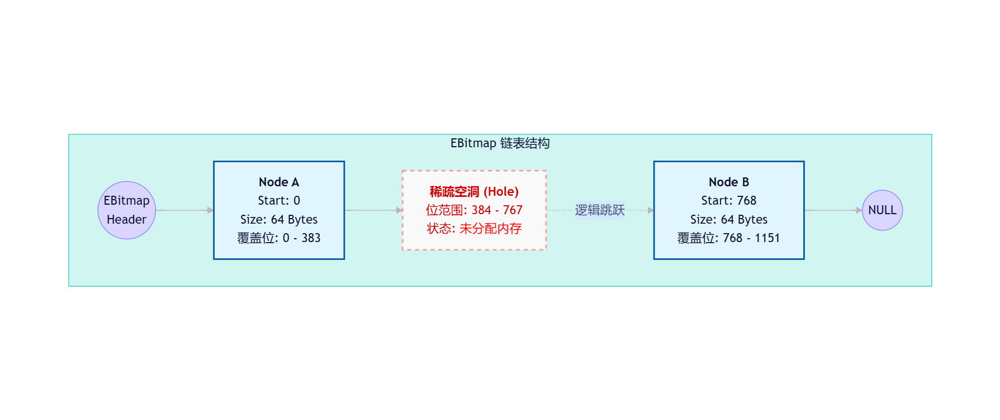

- [SELinux 核心数据结构](#selinux-核心数据结构)
	- [1. 基础数据结构](#1-基础数据结构)
		- [1.1 扩展位图 (Extended Bitmap)](#11-扩展位图-extended-bitmap)
			- [struct ebitmap\_node](#struct-ebitmap_node)
			- [struct ebitmap](#struct-ebitmap)
		- [1.2 哈希表 (Hash Table)](#12-哈希表-hash-table)
			- [struct hashtab\_key\_params](#struct-hashtab_key_params)
			- [struct hashtab\_node](#struct-hashtab_node)
			- [struct hashtab\_info](#struct-hashtab_info)
			- [struct hashtab](#struct-hashtab)
		- [1.3 访问向量表 (AVT)](#13-访问向量表-avt)
			- [struct avtab\_key](#struct-avtab_key)
			- [struct avtab\_extended\_perms](#struct-avtab_extended_perms)
			- [struct avtab\_datum](#struct-avtab_datum)
			- [struct avtab\_node](#struct-avtab_node)
			- [struct avtab](#struct-avtab)
		- [1.4 条件策略 (Conditional Policy)](#14-条件策略-conditional-policy)
			- [struct cond\_expr\_node](#struct-cond_expr_node)
			- [struct cond\_expr](#struct-cond_expr)
			- [struct cond\_av\_list](#struct-cond_av_list)
			- [struct cond\_node](#struct-cond_node)
		- [1.5 约束与 MLS (Constraints \& MLS)](#15-约束与-mls-constraints--mls)
			- [struct constraint\_expr](#struct-constraint_expr)
			- [struct constraint\_node](#struct-constraint_node)
			- [struct mls\_level](#struct-mls_level)
			- [struct mls\_range](#struct-mls_range)
	- [2. 策略数据库核心 (Policy Database)](#2-策略数据库核心-policy-database)
		- [2.1 策略元素定义](#21-策略元素定义)
			- [struct perm\_datum](#struct-perm_datum)
			- [struct common\_datum](#struct-common_datum)
			- [struct class\_datum](#struct-class_datum)
			- [struct role\_datum](#struct-role_datum)
			- [struct role\_trans\_key](#struct-role_trans_key)
			- [struct role\_trans\_datum](#struct-role_trans_datum)
			- [struct filename\_trans\_key](#struct-filename_trans_key)
			- [struct filename\_trans\_datum](#struct-filename_trans_datum)
			- [struct role\_allow](#struct-role_allow)
			- [struct type\_datum](#struct-type_datum)
			- [struct user\_datum](#struct-user_datum)
			- [struct level\_datum](#struct-level_datum)
			- [struct cat\_datum](#struct-cat_datum)
			- [struct range\_trans](#struct-range_trans)
			- [struct cond\_bool\_datum](#struct-cond_bool_datum)
			- [struct type\_set](#struct-type_set)
			- [struct ocontext](#struct-ocontext)
			- [struct genfs](#struct-genfs)
		- [2.2 策略总控](#22-策略总控)
			- [struct policy\_file](#struct-policy_file)
			- [struct policy\_data](#struct-policy_data)
			- [struct policydb](#struct-policydb)
			- [struct policydb\_compat\_info](#struct-policydb_compat_info)
		- [2.3 SID 映射表](#23-sid-映射表)
			- [struct sidtab\_entry](#struct-sidtab_entry)
			- [struct sidtab\_node\_leaf](#struct-sidtab_node_leaf)
			- [struct sidtab\_node\_inner](#struct-sidtab_node_inner)
			- [struct sidtab\_isid\_entry](#struct-sidtab_isid_entry)
			- [struct sidtab\_convert\_params](#struct-sidtab_convert_params)
			- [struct sidtab](#struct-sidtab)
			- [struct sidtab\_str\_cache](#struct-sidtab_str_cache)
		- [2.4 内部服务封装](#24-内部服务封装)
			- [struct selinux\_mapping](#struct-selinux_mapping)
			- [struct selinux\_map](#struct-selinux_map)
			- [struct selinux\_policy](#struct-selinux_policy)
			- [struct convert\_context\_args](#struct-convert_context_args)
			- [struct selinux\_policy\_convert\_data](#struct-selinux_policy_convert_data)
			- [struct selinux\_audit\_rule](#struct-selinux_audit_rule)
	- [3. 运行时缓存 (Access Vector Cache)](#3-运行时缓存-access-vector-cache)
		- [3.1 缓存条目与节点](#31-缓存条目与节点)
			- [struct avc\_entry](#struct-avc_entry)
			- [struct avc\_node](#struct-avc_node)
			- [struct avc\_xperms\_decision\_node](#struct-avc_xperms_decision_node)
			- [struct avc\_xperms\_node](#struct-avc_xperms_node)
		- [3.2 缓存管理](#32-缓存管理)
			- [struct avc\_cache\_stats](#struct-avc_cache_stats)
			- [struct avc\_cache](#struct-avc_cache)
			- [struct avc\_callback\_node](#struct-avc_callback_node)
			- [struct selinux\_avc](#struct-selinux_avc)
		- [3.3 决策辅助结构](#33-决策辅助结构)
			- [struct av\_decision](#struct-av_decision)
			- [struct extended\_perms\_data](#struct-extended_perms_data)
			- [struct extended\_perms\_decision](#struct-extended_perms_decision)
			- [struct extended\_perms](#struct-extended_perms)
			- [struct selinux\_audit\_data](#struct-selinux_audit_data)
	- [4. 全局状态与加载机制](#4-全局状态与加载机制)
		- [4.1 全局状态](#41-全局状态)
			- [struct selinux\_kernel\_status](#struct-selinux_kernel_status)
			- [struct selinux\_load\_state](#struct-selinux_load_state)
			- [struct selinux\_state](#struct-selinux_state)
		- [4.2 文件系统与加载](#42-文件系统与加载)
			- [struct policy\_load\_memory](#struct-policy_load_memory)
			- [struct selinux\_fs\_info](#struct-selinux_fs_info)
			- [struct selinux\_mnt\_opts](#struct-selinux_mnt_opts)
			- [struct lsm\_blob\_sizes](#struct-lsm_blob_sizes)
	- [5. 内核对象安全标签 (LSM Blobs)](#5-内核对象安全标签-lsm-blobs)
		- [5.1 进程与凭证](#51-进程与凭证)
			- [struct task\_security\_struct](#struct-task_security_struct)
			- [struct cred\_security\_struct](#struct-cred_security_struct)
		- [5.2 文件系统对象](#52-文件系统对象)
			- [struct inode\_security\_struct](#struct-inode_security_struct)
			- [struct file\_security\_struct](#struct-file_security_struct)
			- [struct superblock\_security\_struct](#struct-superblock_security_struct)
		- [5.3 IPC 与消息](#53-ipc-与消息)
			- [struct ipc\_security\_struct](#struct-ipc_security_struct)
			- [struct msg\_security\_struct](#struct-msg_security_struct)
		- [5.4 网络与 Socket](#54-网络与-socket)
			- [struct sk\_security\_struct](#struct-sk_security_struct)
			- [struct tun\_security\_struct](#struct-tun_security_struct)
			- [struct netif\_security\_struct](#struct-netif_security_struct)
			- [struct netnode\_security\_struct](#struct-netnode_security_struct)
			- [struct netport\_security\_struct](#struct-netport_security_struct)
		- [5.5 其他子系统对象](#55-其他子系统对象)
			- [struct key\_security\_struct](#struct-key_security_struct)
			- [struct bpf\_security\_struct](#struct-bpf_security_struct)
			- [struct perf\_event\_security\_struct](#struct-perf_event_security_struct)
			- [struct ib\_security\_struct](#struct-ib_security_struct)
			- [struct pkey\_security\_struct](#struct-pkey_security_struct)
	- [6. 网络与特定子系统缓存](#6-网络与特定子系统缓存)
		- [6.1 网络缓存](#61-网络缓存)
			- [struct sel\_netif](#struct-sel_netif)
			- [struct sel\_netnode\_bkt](#struct-sel_netnode_bkt)
			- [struct sel\_netnode](#struct-sel_netnode)
			- [struct sel\_netport\_bkt](#struct-sel_netport_bkt)
			- [struct sel\_netport](#struct-sel_netport)
		- [6.2 InfiniBand 缓存](#62-infiniband-缓存)
			- [struct sel\_ib\_pkey\_bkt](#struct-sel_ib_pkey_bkt)
			- [struct sel\_ib\_pkey](#struct-sel_ib_pkey)
	- [7. 辅助映射与工具](#7-辅助映射与工具)
		- [7.1 映射表](#71-映射表)
			- [struct nlmsg\_perm](#struct-nlmsg_perm)
			- [struct security\_class\_mapping](#struct-security_class_mapping)
		- [7.2 临时数据](#72-临时数据)
			- [struct cond\_insertf\_data](#struct-cond_insertf_data)

# SELinux 核心数据结构

## 1. 基础数据结构

### 1.1 扩展位图 (Extended Bitmap)
#### struct ebitmap_node

* EBitmap（Extended Bitmap） 是一种用于高效存储和管理稀疏位图（Sparse Bitmap）的数据结构
* EBitmap 的解决方案：它采用链表 + 分段位图的方式。只分配实际存有数据的节点，未使用的区间不分配内存，从而极大地节省了内核内存占用，同时保持了较快的访问速度
* 普通位图的问题：SELinux 策略中经常需要处理大量的类型（Types）、角色（Roles）或用户（Users）。如果使用标准的连续位图（如 unsigned long 数组），当位图的最高位（highbit）非常大（例如几十万甚至上百万）但实际设置的位非常稀疏时，会浪费大量内存。

```c
struct ebitmap_node {
	struct ebitmap_node *next; // 指向下一个节点的指针
	unsigned long maps[EBITMAP_UNIT_NUMS]; // 存储实际位数据的数组
	u32 startbit; // 该节点管理的起始位偏移量
};
```

其中EBITMAP_UNIT_NUMS定义如下：

```c
#ifdef CONFIG_64BIT
#define	EBITMAP_NODE_SIZE	64
#else
#define	EBITMAP_NODE_SIZE	32
#endif

#define EBITMAP_UNIT_NUMS	((EBITMAP_NODE_SIZE-sizeof(void *)-sizeof(u32))\
					/ sizeof(unsigned long))
```


EBITMAP_UNIT_NUMS 是一个宏，定义了每个节点能管理多少个 unsigned long。
* 在大多数架构（如 x86_64, arm64）上，unsigned long 是 64 位。
* 通常 EBITMAP_UNIT_NUMS 被定义为使得每个节点的大小接近一个内存页或缓存行友好的大小（常见值为 8 或根据架构调整，总位数通常为 512 位或更多）。
* 这意味着一个节点可以管理 64×EBITMAP_UNIT_NUMS 个位。

```c
crash> struct ebitmap_node
struct ebitmap_node {
    struct ebitmap_node *next;
    unsigned long maps[6];
    u32 startbit;
}
SIZE: 64
crash> 
```

* 现代 CPU 的缓存行（Cache Line）通常为 64 字节。
* 通过将 struct ebitmap_node 设计为正好 64 字节，每次从内存加载一个节点时，都能完美利用一次缓存行读取，不会浪费带宽，也不会导致“伪共享”（False Sharing）影响其他无关数据。

在 CONFIG_64BIT 开启的情况下（如 x86_64, arm64）：
* struct ebitmap_node *next 大小是 sizeof(void *) (指针大小): 64位系统指针为 8 字节。
* u32 startbit的大小sizeof(u32): u32 定义为 32 位无符号整数，固定为 4 字节。
* sizeof(unsigned long): 在 Linux 64位内核中，long 通常是 64 位，即 8 字节。

EBITMAP_NODE_SIZE: 根据代码 #define EBITMAP_NODE_SIZE 64，固定为 64 字节。

这里的设计意图是让整个 struct ebitmap_node 的大小正好等于 64 字节（即一个常见的 CPU 缓存行 Cache Line 的大小），以提高缓存命中率。


宏定义公式如下：
```c
#define EBITMAP_UNIT_NUMS ((EBITMAP_NODE_SIZE - sizeof(void *) - sizeof(u32)) / sizeof(unsigned long))
```

代入数值：
1. 总目标大小: EBITMAP_NODE_SIZE = 64
2. 减去 next 指针: sizeof(void *) = 8
3. 减去 startbit: sizeof(u32) = 4
4. 剩余给 maps 数组的空间: 64−8−4=52 字节, 除以单个元素大小: sizeof(unsigned long) = 8
5. 问题来了，还剩4个字节？编译器自动填充，确保总大小为 64

结论：宏计算结果为 6。这就是为什么 crash 输出中显示 unsigned long maps[6]。这样一个cacheline正好存放下 struct ebitmap_node。

逻辑结构视图:
```text
全局位索引 (Global Bit Index):
0 ....................................................................................................... 200 ...................................................... 500
|---------------------------------------|----------------------(空洞/未分配)--------------------------|---------------------------------------|
^                                       ^                                                          ^
|                                       |                                                          |
Node A (startbit=0)                     Node B (startbit=128)                                      Node C (startbit=384)
[管理范围: 0 ~ 383]                     [管理范围: 128 ~ 511]                                      [管理范围: 384 ~ 767]
(注意：实际有效位只有设置的位)           (注意：中间 128-383 之间如果没有数据，可能没有节点，
                                         这里为了演示连续性假设存在，但实际上如果不连续会跳过)

+----------------+          +----------------+          +----------------+
| struct ebitmap |          | struct ebitmap |          | struct ebitmap |
|----------------|   next   |     node       |   next   |     node       |   next
| node --------->+--------->| (Node A)       +--------->| (Node B)       +---------> NULL
| highbit = 500  |          |----------------|          |----------------|
+----------------+          | startbit = 0   |          | startbit = 128 |
                            | maps[0]: 0x..A |          | maps[0]: 0x000 |
                            | maps[1]: 0x000 |          | maps[1]: 0x004 | (第 130 位被设置)
                            | maps[2]: 0x000 |          | maps[2]: 0x000 |
                            | maps[3]: 0x000 |          | maps[3]: 0x000 |
                            | maps[4]: 0x000 |          | maps[4]: 0x000 |
                            | maps[5]: 0x000 |          | maps[5]: 0x000 |
                            | [padding: 4B]  |          | [padding: 4B]  |
                            +----------------+          +----------------+
                                  ^                           ^
                                  |                           |
                          总大小：64 字节             总大小：64 字节
                          (1 个缓存行)                (1 个缓存行)

```


单个节点的内存布局:

```text
偏移量 (Offset)   大小 (Size)   成员变量              说明
0x00 - 0x07      [8 Bytes]    next                  指针 (struct ebitmap_node *)
                               |                     指向下一个节点 (或 NULL)
                               v
0x08 - 0x0F      [8 Bytes]    maps[0]               unsigned long (位 0-63 相对该节点)
0x10 - 0x17      [8 Bytes]    maps[1]               unsigned long (位 64-127 相对该节点)
0x18 - 0x1F      [8 Bytes]    maps[2]               unsigned long (位 128-191 ...)
0x20 - 0x27      [8 Bytes]    maps[3]               unsigned long
0x28 - 0x2F      [8 Bytes]    maps[4]               unsigned long
0x30 - 0x37      [8 Bytes]    maps[5]               unsigned long (位 320-383 ...)
                               |
                               +---> 总共管理 6 * 64 = 384 个位
                               |
0x38 - 0x3B      [4 Bytes]    startbit              u32 (该节点起始的全局位索引)
0x3C - 0x3F      [4 Bytes]    __padding             编译器自动填充 (为了保证总大小为 64)
                               |
                               +---> 对齐到 64 字节边界 (Cache Line Size)

总大小 (Total Size): 64 Bytes (0x40)
```


```
[EBitmap] --> [Node A: start=0, ...] --> [Node B: start=768, bit800=1] --> NULL
                     ^                         ^
                     |                         |
               占用 64 字节              占用 64 字节
               (管理 0-383)            (管理 768-1151)
               
               !!! 384-767 之间的位 !!!
               !!! 完全没有分配内存 !!! (稀疏性的体现)
```

#### struct ebitmap

```c
struct ebitmap {
	struct ebitmap_node *node;	/* first node in the bitmap */
	u32 highbit;	/* highest position in the total bitmap */
};
```



举栗子：

假设 EBITMAP_UNIT_NUMS 为 8（即每个节点管理 8×64=512 位）。
场景：我们需要设置第 10 位和第 600 位。

```text
初始状态：ebitmap.node = NULL, ebitmap.highbit = 0。

设置第 10 位：
系统分配一个新的 ebitmap_node (Node A)。
设置 Node A.startbit = 0（通常对齐到节点容量的倍数）。
在 Node A.maps[0] 的第 10 位设为 1。
更新 ebitmap.node = Node A。
更新 ebitmap.highbit = 10。

设置第 600 位：
计算发现 600 超出了 Node A 的范围（0 ~ 511）。
系统分配新节点 (Node B)。
设置 Node B.startbit = 512。
在 Node B.maps 中找到对应 600 的位置（600−512=88 ，即 maps[1] 的第 24 位）并设为 1。
将 Node A.next 指向 Node B。
更新 ebitmap.highbit = 600。
```

内存节省分析：如果使用普通位图覆盖 0~600 位，至少需要 ⌈601/8⌉=76 字节（实际上通常会按字对齐更多）。如果最高位是 1,000,000 但只有两位被设置，普通位图需要约 125KB，而 EBitmap 只需要两个节点（约几十字节到一百多字节）。

在 Linux 6.6 内核的 SELinux 模块中，EBitmap 广泛用于：

* 类型集（Type Sets）：在策略规则中，源类型和目标类型往往不是单个类型，而是一组类型。EBitmap 高效地存储这些集合。
* 角色映射：用户允许担任的角色集合。
* 权限向量缓存：加速访问向量缓存（AVC）的查找。
* 策略数据库：加载二进制策略文件时，大量的位图数据都被反序列化为 EBitmap 结构。

### 1.2 哈希表 (Hash Table)
#### struct hashtab_key_params

```c
// O:\security\selinux\ss\hashtab.h
struct hashtab_key_params {
	u32 (*hash)(const void *key);	/* hash function */
	int (*cmp)(const void *key1, const void *key2);
					/* key comparison function */
};

```

* 不关心存储的具体数据是什么（是安全上下文字符串？是类定义？还是布尔值？），只关心如何哈希和比较
* 

#### struct hashtab_node

```c
// O:\security\selinux\ss\hashtab.h
struct hashtab_node {
	void *key;
	void *datum;
	struct hashtab_node *next;
};
```

* 浅拷贝：插入时，哈希表只复制指针地址，不复制 key 指向的实际数据。如果外部释放了 key 的内存，哈希表就会变成悬空指针（Dangling Pointer）。
* 典型布局：在 SELinux 中，key 往往指向一个字符串常量或动态分配的字符串，datum 指向一个包含 SID（Security ID）的结构体。


#### struct hashtab_info

```c
// O:\security\selinux\ss\hashtab.h
struct hashtab_info {
	u32 slots_used; // 有多少个桶是非空的（用于计算负载因子）
	u32 max_chain_len; // 最长链表的长度（衡量最坏情况下的查找代价）
};
```
#### struct hashtab

```c
// O:\security\selinux\ss\hashtab.h
struct hashtab {
	struct hashtab_node **htable;	/* hash table */
	u32 size;			/* number of slots in hash table */
	u32 nel;			/* number of elements in hash table */
};
```


A. 查找流程 (hashtab_search)

```text
输入: key (例如 "sysadm_r")
  ↓
1. 计算哈希值: h = params->hash(key)
  ↓
2. 计算桶索引: idx = h % ht->size
  ↓
3. 定位桶头: node = ht->htable[idx]
  ↓
4. 遍历链表:
   while (node != NULL) {
       if (params->cmp(node->key, key) == 0) {
           return node->datum;  // 找到！返回关联数据
       }
       node = node->next;
   }
  ↓
5. 未找到: return NULL
```


B. 插入流程 (hashtab_insert)
发生在策略加载阶段（系统启动或 load_policy 时）。

```text
输入: key, datum
  ↓
1. 计算索引 idx (同上)
  ↓
2. 检查冲突: 遍历 htable[idx] 链表
   - 如果发现 key 已存在: 返回错误 (EEXIST)，防止策略重复定义
  ↓
3. 创建新节点: new_node = kzalloc(sizeof(*new_node), GFP_KERNEL)
  ↓
4. 赋值: 
   new_node->key = key;
   new_node->datum = datum;
   new_node->next = ht->htable[idx]; // 头插法
  ↓
5. 更新桶头: ht->htable[idx] = new_node
  ↓
6. 更新计数: ht->nel++
```


### 1.3 访问向量表 (AVT)

* 访问向量表 (Access Vector Table, AVT) 是策略数据库的核心组成部分。它存储了所有的访问控制规则（例如：“进程类型 A 可以读取 文件类型 B”）。


#### struct avtab_key

```c
struct avtab_key {
	u16 source_type;	/* source type */ // 源类型 (Subject): 通常是进程的 SELinux 类型 ID
	u16 target_type;	/* target type */ // 目标类型 (Object): 通常是文件、socket 等的 SELinux 类型 ID
	u16 target_class;	/* target object class */ // 目标类别 (Class): 对象的类别 (如 file, dir, tcp_socket)
#define AVTAB_ALLOWED		0x0001
#define AVTAB_AUDITALLOW	0x0002
#define AVTAB_AUDITDENY		0x0004
#define AVTAB_AV		(AVTAB_ALLOWED | AVTAB_AUDITALLOW | AVTAB_AUDITDENY)
#define AVTAB_TRANSITION	0x0010
#define AVTAB_MEMBER		0x0020
#define AVTAB_CHANGE		0x0040
#define AVTAB_TYPE		(AVTAB_TRANSITION | AVTAB_MEMBER | AVTAB_CHANGE)
/* extended permissions */
#define AVTAB_XPERMS_ALLOWED	0x0100
#define AVTAB_XPERMS_AUDITALLOW	0x0200
#define AVTAB_XPERMS_DONTAUDIT	0x0400
#define AVTAB_XPERMS		(AVTAB_XPERMS_ALLOWED | \
				AVTAB_XPERMS_AUDITALLOW | \
				AVTAB_XPERMS_DONTAUDIT)
#define AVTAB_ENABLED_OLD   0x80000000 /* reserved for used in cond_avtab */
#define AVTAB_ENABLED		0x8000 /* reserved for used in cond_avtab */
	u16 specified;	/* what field is specified */ // 规则类型标志位: 定义了什么类型的规则 (允许? 审计? 类型转换?)
};
```

* specified 字段详解: 这是一个位掩码 (Bitmask)，决定了 datum 中数据的含义。
  - AVTAB_ALLOWED (0x0001): 标准的允许规则 (Allow)。datum.data 是一个权限位图 (如 READ | WRITE)。
  - AVTAB_TRANSITION (0x0010): 类型转换规则。当源类型访问目标类型时，生成的新进程的类型是什么？datum.data 是新类型的 ID。
  - AVTAB_XPERMS (0x0100 等): 扩展权限。用于处理像 ioctl 这样拥有数百种命令的场景，此时 datum.xperms` 指向一个扩展结构。


#### struct avtab_extended_perms

```c
/*
 * For operations that require more than the 32 permissions provided by the avc
 * extended permissions may be used to provide 256 bits of permissions.
 */
struct avtab_extended_perms {
/* These are not flags. All 256 values may be used */
#define AVTAB_XPERMS_IOCTLFUNCTION	0x01
#define AVTAB_XPERMS_IOCTLDRIVER	0x02
	/* extension of the avtab_key specified */
	u8 specified; /* ioctl, netfilter, ... */ // 扩展类型 (如 AVTAB_XPERMS_IOCTLFUNCTION)
	/*
	 * if 256 bits is not adequate as is often the case with ioctls, then
	 * multiple extended perms may be used and the driver field
	 * specifies which permissions are included.
	 */
	u8 driver; // 驱动索引。如果 256 位还不够，可以有多个节点，driver 区分它们。
	/* 256 bits of permissions */
	struct extended_perms_data perms; // 实际的数据，通常包含一个 256 位的位图数组
};
```

* 标准的权限位图只有 32 位（支持 32 种权限）。但对于 ioctl 或 netfilter，可能有成百上千种命令。这个结构体提供了 256 位 的权限空间。

举例子：

假设某设备有 500 种 ioctl 命令。标准位图存不下。系统会创建两个 avtab_extended_perms 节点：
1. Node 1 (driver=0): 存储命令 0-255 的权限。
2. Node 2 (driver=1): 存储命令 256-511 的权限。


#### struct avtab_datum

```c
struct avtab_datum {
	union {
		u32 data; /* access vector or type value */ // 普通情况：权限位图 (如 0x0005) 或 新类型 ID
		struct avtab_extended_perms *xperms; // 扩展情况：指向扩展权限结构的指针
	} u;
};
```


#### struct avtab_node

```c
struct avtab_node {
	struct avtab_key key;
	struct avtab_datum datum;
	struct avtab_node *next;
};
```


#### struct avtab

```c
struct avtab {
	struct avtab_node **htable;
	u32 nel;	/* number of elements */
	u32 nslot;      /* number of hash slots */
	u32 mask;       /* mask to compute hash func */
};
```


### 1.4 条件策略 (Conditional Policy)

#### struct cond_expr_node
#### struct cond_expr
#### struct cond_av_list
#### struct cond_node

### 1.5 约束与 MLS (Constraints & MLS)
#### struct constraint_expr
#### struct constraint_node
#### struct mls_level
#### struct mls_range

## 2. 策略数据库核心 (Policy Database)

### 2.1 策略元素定义
#### struct perm_datum
#### struct common_datum
#### struct class_datum
#### struct role_datum
#### struct role_trans_key
#### struct role_trans_datum
#### struct filename_trans_key
#### struct filename_trans_datum
#### struct role_allow
#### struct type_datum
#### struct user_datum
#### struct level_datum
#### struct cat_datum
#### struct range_trans
#### struct cond_bool_datum
#### struct type_set
#### struct ocontext
#### struct genfs

### 2.2 策略总控

#### struct policy_file

#### struct policy_data

#### struct policydb


```c
// O:\security\selinux\ss\services.h
/* Mapping for a single class */
struct selinux_mapping {
	u16 value; /* policy value for class */
	u16 num_perms; /* number of permissions in class */
	u32 perms[sizeof(u32) * 8]; /* policy values for permissions */
};

/* Map for all of the classes, with array size */
struct selinux_map {
	struct selinux_mapping *mapping; /* indexed by class */
	u16 size; /* array size of mapping */
};

struct selinux_policy {
	struct sidtab *sidtab;
	struct policydb policydb;
	struct selinux_map map;
	u32 latest_granting;
} __randomize_layout;
```

* 最核心的策略数据库结构。它是在内核启动时或用户态加载策略文件（binary policy）后，解析生成的内存驻留策略表示。所有的权限检查最终都依赖于这个结构中的数据


#### struct policydb_compat_info

### 2.3 SID 映射表
#### struct sidtab_entry
#### struct sidtab_node_leaf
#### struct sidtab_node_inner
#### struct sidtab_isid_entry
#### struct sidtab_convert_params
#### struct sidtab
#### struct sidtab_str_cache

### 2.4 内部服务封装
#### struct selinux_mapping
#### struct selinux_map
#### struct selinux_policy
#### struct convert_context_args
#### struct selinux_policy_convert_data
#### struct selinux_audit_rule

## 3. 运行时缓存 (Access Vector Cache)

### 3.1 缓存条目与节点
#### struct avc_entry

```c
// O:\security\selinux\avc.c
struct avc_entry {
	u32			ssid;
	u32			tsid;
	u16			tclass;
	struct av_decision	avd;
	struct avc_xperms_node	*xp_node;
};

```
#### struct avc_node

```c
// O:\security\selinux\avc.c
struct avc_node {
	struct avc_entry	ae;
	struct hlist_node	list; /* anchored in avc_cache->slots[i] */
	struct rcu_head		rhead;
};

```
#### struct avc_xperms_decision_node

```c
// O:\security\selinux\avc.c
struct avc_xperms_decision_node {
	struct extended_perms_decision xpd;
	struct list_head xpd_list; /* list of extended_perms_decision */
};

```
#### struct avc_xperms_node

```c
// O:\security\selinux\avc.c
struct avc_xperms_node {
	struct extended_perms xp;
	struct list_head xpd_head; /* list head of extended_perms_decision */
};
```

### 3.2 缓存管理
#### struct avc_cache_stats

```c
// O:\security\selinux\include\avc.h
/*
 * AVC statistics
 */
struct avc_cache_stats {
	unsigned int lookups;
	unsigned int misses;
	unsigned int allocations;
	unsigned int reclaims;
	unsigned int frees;
};
```

#### struct avc_cache

```c
// O:\security\selinux\avc.c
struct avc_cache {
	struct hlist_head	slots[AVC_CACHE_SLOTS]; /* head for avc_node->list */
	spinlock_t		slots_lock[AVC_CACHE_SLOTS]; /* lock for writes */
	atomic_t		lru_hint;	/* LRU hint for reclaim scan */
	atomic_t		active_nodes;
	u32			latest_notif;	/* latest revocation notification */
};

```


#### struct avc_callback_node

```c
// O:\security\selinux\avc.c
struct avc_callback_node {
	int (*callback) (u32 event);
	u32 events;
	struct avc_callback_node *next;
};

```

#### struct selinux_avc

```c
// O:\security\selinux\avc.c
struct selinux_avc {
	unsigned int avc_cache_threshold;
	struct avc_cache avc_cache;
};

```

avc_cache_threshold：控制缓存大小的水位线。
- 当 active_nodes 超过这个阈值时，触发后台回收机制。默认是 512，但可以根据系统负载动态调整。


### 3.3 决策辅助结构
#### struct av_decision
#### struct extended_perms_data
#### struct extended_perms_decision
#### struct extended_perms
#### struct selinux_audit_data

## 4. 全局状态与加载机制

### 4.1 全局状态
#### struct selinux_kernel_status
#### struct selinux_load_state
#### struct selinux_state


```c
// O:\security\selinux\include\security.h
struct selinux_policy;

struct selinux_state {
#ifdef CONFIG_SECURITY_SELINUX_DEVELOP
	bool enforcing; // 决定 SELinux 是处于强制模式 (Enforcing) 还是 宽容模式 (Permissive)
#endif
	bool initialized; // 标记 SELinux 子系统是否已完成初始化（即策略是否已加载）防止还未初始化就进行安全检查
	bool policycap[__POLICYDB_CAP_MAX]; // 策略能力位图（Policy Capabilities）

	struct page *status_page; // 状态页与锁机制，基于页的同步机制
	struct mutex status_lock;

	struct selinux_policy __rcu *policy; // 指向当前SELinux 策略对象。包含策略数据库、符号表、访问向量缓存的引用等核心数据。
	struct mutex policy_mutex; // 互斥锁，保护策略的加载和替换过程
} __randomize_layout; //对抗内存破坏漏洞。每次内核编译，成员的顺序都可能不同，增加利用难度.
```

* 历史背景：在早期的 Linux 内核中，SELinux 的状态信息（如是否启用、强制模式开关、当前策略指针等）分散在多个独立的全局变量中（例如 selinux_enabled, selinux_enforcing, policydb, sidtab 等）。这种“散弹式”的全局变量管理方式存在耦合度高、难以维护、不利于扩展等问题
* 存储 SELinux 的全局运行时状态。在 6.6 内核中，它取代了早期版本中大量分散的全局变量，实现了更好的封装和多命名空间支持的基础（尽管多命名空间仍在开发中，但结构已准备好）
* 设计目标：
  - 封装性（Encapsulation）：将所有与 SELinux 运行时状态相关的数据聚合到一个结构中，通过操作这个结构体实例来管理状态，而非直接操作散乱的全局变量。
  - 多命名空间支持（Multi-namespace Support）：这是最关键的长远目标。虽然目前（截至 6.6/6.7）Linux 主要支持单例 SELinux 策略，但将状态结构化是为未来实现每个网络命名空间或用户命名空间拥有独立 SELinux 策略打下基础。如果未来需要支持多租户隔离的安全策略，只需为每个命名空间实例化一个 selinux_state 即可，而无需重构整个子系统。
  - 并发安全与随机化布局：配合 __randomize_layout 和 RCU 机制，提高内核抗攻击能力和读写性能。

* struct selinux_state 不仅仅是一个结构体，它是 SELinux 子系统架构演进的里程碑。

| 特性 | 传统实现 (Pre-Refactor) | 现代实现 (struct selinux_state) |
| :--- | :--- | :--- |
| 状态管理 | 分散的全局变量 (`selinux_enforcing`, `policydb` 等) | 集中封装在单一结构体中 |
| 并发模型 | 粗粒度锁或复杂的原子操作 | RCU (读) + Mutex (写) 的清晰分离 |
| 用户态通知 | 轮询或简单的等待队列 | 高效的 mmap status page 机制 |
| 扩展性 | 难以支持多策略实例 | 原生支持多实例（为命名空间做准备） |
| 安全性 | 固定内存布局 | 随机化布局 (`__randomize_layout`) 防利用 |


### 4.2 文件系统与加载
#### struct policy_load_memory
#### struct selinux_fs_info
#### struct selinux_mnt_opts
#### struct lsm_blob_sizes

## 5. 内核对象安全标签 (LSM Blobs)

### 5.1 进程与凭证
#### struct task_security_struct

```c
// O:\security\selinux\include\objsec.h
struct task_security_struct {
	u32 osid;		/* SID prior to last execve */
	u32 sid;		/* current SID */
	u32 exec_sid;		/* exec SID */
	u32 create_sid;		/* fscreate SID */
	u32 keycreate_sid;	/* keycreate SID */
	u32 sockcreate_sid;	/* fscreate SID */
} __randomize_layout;
```


#### struct cred_security_struct

### 5.2 文件系统对象
#### struct inode_security_struct
#### struct file_security_struct
#### struct superblock_security_struct

### 5.3 IPC 与消息
#### struct ipc_security_struct
#### struct msg_security_struct

### 5.4 网络与 Socket
#### struct sk_security_struct
#### struct tun_security_struct
#### struct netif_security_struct
#### struct netnode_security_struct
#### struct netport_security_struct

### 5.5 其他子系统对象
#### struct key_security_struct
#### struct bpf_security_struct
#### struct perf_event_security_struct
#### struct ib_security_struct
#### struct pkey_security_struct

## 6. 网络与特定子系统缓存

### 6.1 网络缓存
#### struct sel_netif
#### struct sel_netnode_bkt
#### struct sel_netnode
#### struct sel_netport_bkt
#### struct sel_netport

### 6.2 InfiniBand 缓存
#### struct sel_ib_pkey_bkt
#### struct sel_ib_pkey

## 7. 辅助映射与工具

### 7.1 映射表
#### struct nlmsg_perm
#### struct security_class_mapping

### 7.2 临时数据
#### struct cond_insertf_data


---